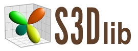

# Python classes to create 3D objects rendered in *Matplotlib*

**Detailed documentation and numerous examples are provided at
[s3dlib.org](https://s3dlib.org)**

---
## Usage

S3Dlib simplifies the construction of 3D objects by the functional mapping of predefined geometries in planar, polar, cylindrical and spherical coordinates.  Using these geometries removes the development effort of constructing a network of vertex coordinates.

Using S3Dlib, surface and lines may be rendered in Matplotlib using a three-step process:

1. define function(s) for mapping geometry and color.
2. instantiate a predefined object followed by applying the mapping functions.
3. add the shaded objects to the *Matplotlib* 3Daxis with annotation and show.


For example, using the Python code:

```python
import numpy as np
import matplotlib.pyplot as plt
import s3dlib.surface as s3d

# 1. Define function to examine .....................................
def knot(rtz) :
    r,t,z = rtz
    rho,zeta,delta = 0.25, 0.3, 0.3
    R = (1-rho)*(1-delta*np.sin(3*t)) + rho*np.cos(z*np.pi) 
    Z = rho*np.sin(z*np.pi) + zeta*np.cos(3*t)
    return R, 2*t, Z

# 2. Setup and map surface  .........................................
surface = s3d.CylindricalSurface(6)
surface.map_cmap_from_op(lambda c: c[1],'hsv')
surface.map_geom_from_op( knot )

# 3. Construct figure & axes, add surface, show .....................
fig, ax = plt.subplots(subplot_kw={"projection": "3d"})
ax.set( xlim=(-1,1),ylim=(-1,1),zlim=(-1,1) )
ax.add_collection3d(surface.shade().hilite(.75))
plt.show()
```

produces the figure:

<p align='center'></p>

---
This approach is particularly useful when visualizing the effect of function parameter values on surface geometry. 
An effect of a single parameter is shown below by visually comparing the shape of the twisted strip. The code for generating this figure is in the *examples* directory.

<p align='center'></p>

Likewise, a table of surfaces can represent a two-parameter function.  The example below shows the shapes for spherical harmonics using the [scipy function](https://docs.scipy.org/doc/scipy/reference/generated/scipy.special.sph_harm.html).

<p align='center'></p>

---
Geometry and color can be accessed from image data.  For example, using the images:

<p align='center'></p>

geometry and color are mapped to a spherical object, resulting in:

<p align='center'></p>

This figure was generated with the following Python script:

```python
from matplotlib import pyplot as plt
import s3dlib.surface as s3d

# 2. Setup and map surfaces .........................................
earth = s3d.SphericalSurface(6)
earth.map_color_from_image('data/earth.png')
earth.map_geom_from_image('data/elevation.png',0.06)
earth.transform(rotate=s3d.eulerRot(175,0) )

# 3. Construct figure, add surfaces, and plot ......................

fig = plt.figure(figsize=plt.figaspect(1) )
ax = plt.axes(projection='3d', facecolor='k')
minmax = (-1,1)
ax.set(xlim=minmax, ylim=minmax, zlim=minmax)
ax.set_axis_off()

ax.add_collection3d(earth.shade( contrast=1.7, direction=[1,0.8,1] ))

fig.tight_layout(pad=0)
plt.show()
```


---
## Surface Contours

Line contours can be constructed directly from 3D surfaces. The contours are line objects which also have mapping functionality.
The following figure, contours are initially generated from the surface. The line color is taken, by default, from the surface.
These contours are then mapped to an ofset xy-plane.  Both surface and contours are finally added to the Matplotlib axes.

<p align='center'></p>

The above figure was generated using the following code:

```python
import numpy as np
import matplotlib.pyplot as plt
import s3dlib.surface as s3d

# 1. Define function to examine ....................................

def townsend(xyz) :
    x,y,z = xyz
    A = -np.cos( (x-0.1)*y )**2
    B = -np.sin(3*x + y)
    return x, y, (A + x*B)

# 2. Setup and map surface .........................................

plane = s3d.PlanarSurface(6).domain( 2.25, (-2.5, 1.75) )
plane.map_geom_from_op(townsend)
plane.map_cmap_from_op()     # default: z-direction

contours = plane.contourLineSet(20)
contours.map_to_plane( -5 )  # default: xy plane
contours.set_linewidth(1)

# 3. Construct figure & axes, add surface & contours, show .........

fig = plt.figure()
ax = plt.axes(projection='3d', proj_type='ortho')
ax.set(xlabel='X',ylabel='Y',zlabel='Z')

s3d.auto_scale(ax,plane,contours)
ax.add_collection3d(plane.shade(0.5).hilite(.5))
ax.add_collection3d(contours)

fig.tight_layout(pad=0)
plt.show()
```

---
## Ruled Surfaces

Just as line objects can be created from surface objects, ruled surfaces can be created from line objects. Considering the case of a hyperboloid of revolution, the surface is generated using two circles:

<p align='center'></p>

For this case, the following function and object construction are shown below.  The complete script with the Matplotlib figure creation is given in the *examples* directory.

```python
# 1. Define functions to examine ....................................

def circle(t,r,z,twist) :
    theta = (2*t+twist)*np.pi
    x = r*np.cos(theta)
    y = r*np.sin(theta)
    z = z*np.ones(len(t))
    return x,y,z

radius, twist = 1, 0.75
top_circle = lambda t: circle(t,radius,1,0.0)
btm_circle = lambda t: circle(t,radius,-1.0,twist)

# 2. Setup and map surfaces .........................................
rez=3

line_1 = s3d.ParametricLine(rez,top_circle,color='firebrick')
line_2 = s3d.ParametricLine(rez,btm_circle,color='teal')
lines = line_1 + line_2
lines.set_linewidth(4)

edges = line_1.get_surface_to_line(line_2).edges # create temp surface for 'simple' edges.
edges.set_color('k')

surface = line_1.get_surface_to_line(line_2,lrez=6) # surface takes line_1 color.
surface.triangulate()
```

---
## Color Maps

Included in S3Dlib is a module containing various functions to create custom color maps. All functions return a Matplotlib colormap.

For example, to create a simple binary colormap:


```python
import s3dlib.cmap_utilities as cmu
bcmap = cmu.binary_cmap('silver', 'sandybrown', name='slvr_brwn' )
```

produces a colormap as:

<p align='center'></p>

Using this colormap, different colors on the back and front of an orientable surface can be visualized as shown below:  

<p align='center'></p>

For this case, the colormapping and shading include the axes view information, as shown in the following code by passing the axes argument value into the mapping and shading methods:

```python
import numpy as np
from matplotlib import pyplot as plt
import s3dlib.surface as s3d
import s3dlib.cmap_utilities as cmu

# 1. Define function to examine .....................................
def twistFunction(rtz,twists=6) :
    r,t,z = rtz
    phi = twists*t/2
    w = 0.33*z 
    R = 1 + w * np.cos(phi)
    Z = w * np.sin(phi)
    return R,t,Z

# 2. Setup and map surfaces .........................................
bcmap = cmu.binary_cmap('silver', 'sandybrown', name='slvr_brwn' )

surface = s3d.CylindricalSurface(5, basetype='squ_s', cmap=bcmap)
surface.map_geom_from_op( twistFunction )

# 3. Construct figures, add surface, plot ...........................
minmax = (-.8,.8)
fig = plt.figure(figsize=plt.figaspect(1))
ax = plt.axes(projection='3d')
ax.set(xlim=minmax, ylim=minmax, zlim=minmax)
ax.set_axis_off()

ax.view_init(azim=-70)
surface.map_cmap_from_normals(direction=ax)
ax.add_collection3d(surface.shade(ax=ax).hilite(ax=ax))

fig.tight_layout(pad=0)
plt.show()
```

---
## 2D Colormaps

Colormaps are one-dimensional in that a single color represents a single scalar value.  S3Dlib includes the class **DualCmap** which provides the ability to represent two values from a two-dimensional color map.

Consider the 'DualCmap' shown below.

<p align='center'></p>


In the following figure, surfaces are parameterized by the u,v coordinates with values indicated by this two-dimensional colormap.
 

<p align='center'></p>

The Python script to construct the above figure is located in the *examples* directory.

---
##General

**Version** 1.1.0

**Documentation:**
>[s3dlib.org](https://s3dlib.org)

**Dependencies:**
>* Python 3.6+
>* Numpy
>* Matplotlib
>* Colorspacious
>* SciPy

**License:**
>MIT, see  [LICENSE](/LICENSE/LICENSE.txt) for details.

**Contact:**
>Frank Zaverl, Jr. <fzaverl@s3dlib.org>


