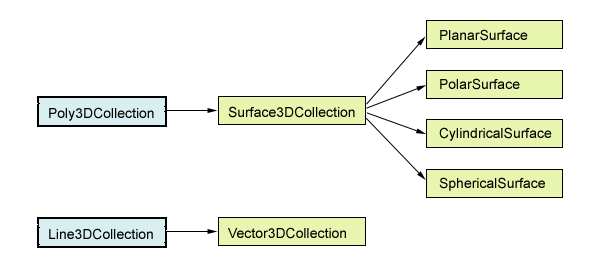

S3Dlib API
=================

Classes
---------------------------------------------

S3Dlib classes are derived from the Matplotlib 
`Poly3DCollection <https://matplotlib.org/api/_as_gen/mpl_toolkits.mplot3d.art3d.Poly3DCollection.html>`_
and
`Line3DCollection <https://matplotlib.org/api/_as_gen/mpl_toolkits.mplot3d.art3d.Line3DCollection.html>`_
classes.

.. toctree::

   clss_mod/surface.base 
   clss_mod/surface.planar 
   clss_mod/surface.polar 
   clss_mod/surface.cyl 
   clss_mod/surface.sph 
   clss_mod/surface.vect 

Functions in s3dlib.surface Module
---------------------------------------------

.. toctree::

   clss_mod/surface.func

Functions in s3dlib.cmap_utilities Module
---------------------------------------------

All functions in these modules return a Matplotlib
`Colormap <https://matplotlib.org/api/_as_gen/matplotlib.colors.Colormap.html>`_ .

.. toctree::

   clss_mod/cmap_utilities

Auxiliary Function
---------------------------------------------

These functions are **not** contained in the S3Dlib package.  They provide useful functionality
but require the installation of additional open-source packages.

.. toctree::

   clss_mod/cmap_xtra 

