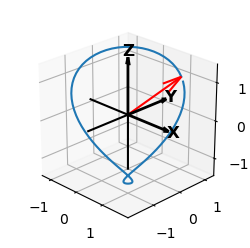

.. _anim_pycube:

.. role::  raw-html(raw)
    :format: html

********************************************************
View_init() Elev and Azim Reset and Shading
********************************************************

.. image:: images/anim_pycube.png
   :class: sphx-glr-single-img

Animation control:

===========================      ===================================================
Visualization                    Frame Value
===========================      ===================================================
Surface geometry                 constant 
Surface position                 fixed to the coordinate axis
Surface color                    constant
Shading and highlighting         illumination **direction** per frame
Axis coordinate                  **elev** and  **azim** per frame using *view_init* 
===========================      ===================================================

Surface construction is based on the :ref:`pycube` example.
Now, both the *elev* and *azim* are changed per frame.
Changing the axis coordinate *and* shading/highlighting results in 'stationary viewer' perception.
The view is rotated about a single surface object.  The illumination direction path as the
*elev* and *azim* changes is shown in the following plot.  The starting direction [1,1,1] is shown
in red.

In the script that follows, note the following line::

   if view_elev >= 270 : view_elev = view_elev - 360

This was needed since the *elev* argument in the call to 'view_init' only provides a unique 
solution in the domain of :raw-html:`-90&deg;` to :raw-html:`270&deg;`.

.. literalinclude:: source/ex_anim_pycube.py
   :language: python
   :emphasize-lines: 68-71,74,77

