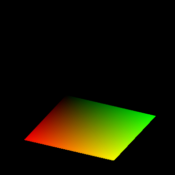

.. _anim_rgb_cube:

****************************
RGB Mapping
****************************

Animation control:

===========================      ============================================
Visualization                    Frame Value
===========================      ============================================
Surface geometry                 sectioning **parameter** per frame
Surface position                 fixed to the coordinate axis
Surface color                    constant
Shading and highlighting         fixed to the coordinate axis
Axis coordinate                  constant 
===========================      ============================================

.. literalinclude:: source/ex_anim_rgb_cube.py
   :language: python
   :emphasize-lines: 88

