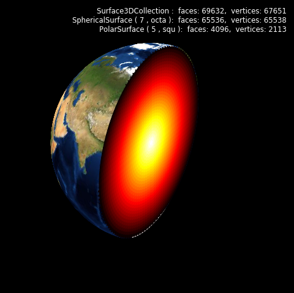
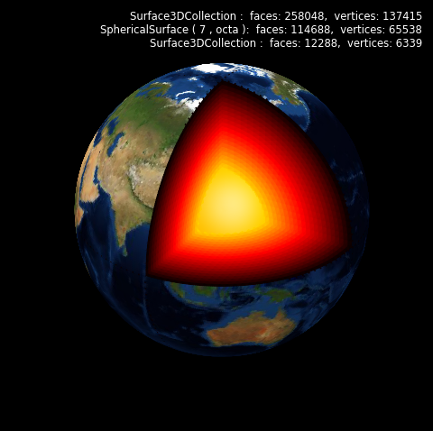

.. _sliced_earth:

*****************************
Different Sub-surface Types
*****************************

.. literalinclude:: source/ex_sliced_earth.py
   :language: python

And just to make it a little more interesting, add a couple more surfaces and use the
clipping function found in the :ref:`clipping` example.

where the surface is now defined as:

.. literalinclude:: source/ex_sliced_earth2.py
   :language: python
   :lines: 20-37
