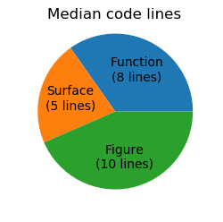

.. _pcnt:

.. role::  raw-html(raw)
    :format: html

**************************************
Percentile Visualization
**************************************

.. image:: images/pcnt.png
   :class: sphx-glr-single-img

The data points are colored using a colormap to indicate the percentile value of the data
point from 0 to :raw-html:`95&percnt;`.  Values greater than :raw-html:`95&percnt;` are indicated by red.

.. literalinclude:: source/ex_pcnt.py
   :language: python

The following plot is similar to the above, but now a colormap is used to indicate the percentile value of the
data point above :raw-html:`50&percnt;` to :raw-html:`100&percnt;`.  
Values below :raw-html:`50&percnt;` are indicated by grey.

.. image:: images/pcnt2.png
   :class: sphx-glr-single-img

The input csv file for this plot is a Nx3 data set representing the number of code lines
used to create the example surface plots (for demo purposes, two large data sets and animations were not 
included). An alternative comparison of the 'median' values is simply a pie chart:

.. literalinclude:: source/ex_pcnt2.py
   :language: python

