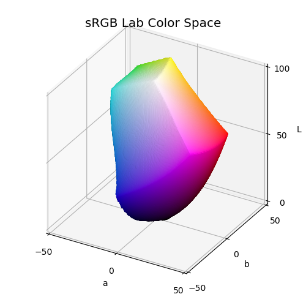
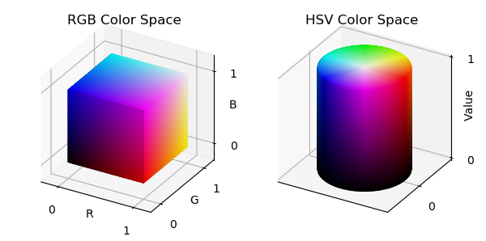

.. _Lab_space:

**************************************
Color Space
**************************************

For the Lab surface, the algorithm is based on using the spherical surface vertices as directional
unit vectors in Lab space.
Then, searching for out-of-gamut colors is performed along directions using a simple binary chop algorithm.  Not the
fastest tool in the shed but it digs the hole.

.. literalinclude:: source/ex_Lab_space.py
   :language: python

For the RGB and HSV surfaces, a unit surface is set in the native color space coordinate system and
color mapped directly.

.. literalinclude:: source/ex_rgb_hsv_space.py
   :language: python

