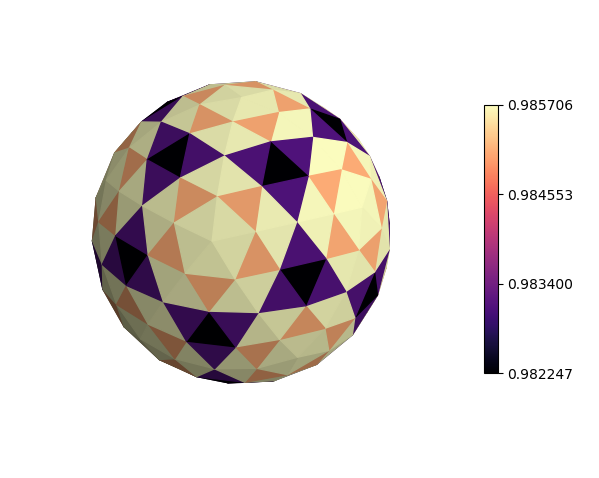

.. _color_tri:

***********************
Base Face Variations
***********************

Although all surface vertices are the same length (r=1), the face centers are
slightly different due to the recursive triangulation.  This results in a  
pattern developing when the color map is based on the normalized face
center radial position.  As seem from the colorbar, variations in face
radial position is less than 0.0035.  The pattern persists for higher rez values.

.. literalinclude:: source/ex_color_tri.py
   :language: python

