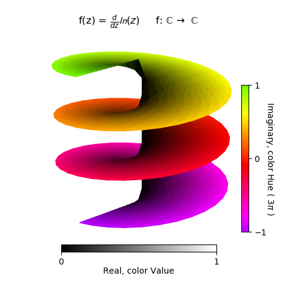
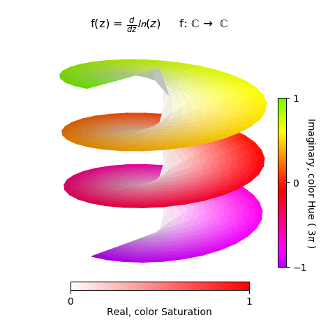

.. _complex_hsv:

.. role::  raw-html(raw)
    :format: html

*******************************************************
Complex Number Representation, Hue and Value 
*******************************************************

In this simple example, r and :raw-html:`&theta;` represent the real
and imaginary components of the function, respectively.  To differentiate
these two components, the value and hue of the surface color is used, along
with the surface geometry.

.. literalinclude:: source/ex_complex_hsv.py
   :language: python
   :emphasize-lines: 22,23,33

To construct the colorbars, two colormaps were created using the
*hsv_cmap_gradient* method.  The *purple2green* colormap was
assigned as the default colormap for the surface object during instantiation.
However, this map was only used for the creation of the Imaginary colorbar
using the surface object property *cBar_ScalarMappable*.

To use the color saturation as the visual indicator of the Real
component, the two highlighted lines in the *hsv_color* method is
simply changed as::

    v = np.ones(len(r))
    s = r

to produce the following figure.  The *valmap* color map was modified 
to reflect the description in the Real colorbar along with the labeled text.
In addition, shading of 0.7 was applied to enhance the 3D visualization.

The *map_color_from_op* method was also used in the :ref:`RGB_sphere` example.