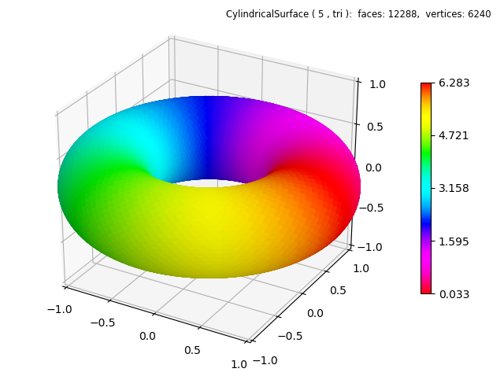
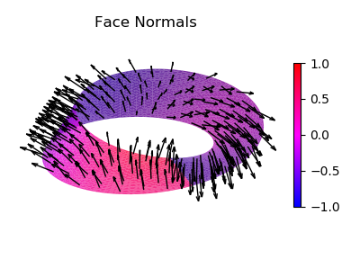
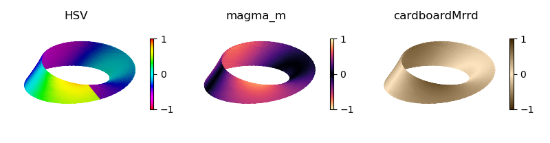

.. _cyclic_mirror:

.. role::  raw-html(raw)
    :format: html

******************************
Cyclic and Mirrored Colormaps
******************************

Cyclic Colormaps
===========================================================

.. literalinclude:: source/ex_hsv_torus.py
   :language: python
   :emphasize-lines: 20

In cylindrical, polar, and spherical coordinates,  the angular coordinate is
cyclic.  The geometry is continuous for :raw-html:`&theta;` 
equal from :raw-html:`2&pi;` to 0. For the coloration to be continuous at this
position, the colormap must also be cyclic.   
Matplotlib provides three registered
`cyclic colormaps <https://matplotlib.org/3.1.1/tutorials/colors/colormaps.html#cyclic>`_
'twilight', 'twilight_shifted', and 'hsv'.
For this torus surface, the modified version of the 'hsv' colormap was used for
the color based on mapping using the angular position.

Mirrored Colormaps
===========================================================

The :ref:`color_maps` contain numerous mirroring color map creation functions.  These
functions can also be used to produce cyclic colormaps from any colormap.

Colormaps are also useful for illustrating the geometry by applying colormaps
by :ref:`shading`.  Using this technique, most colormaps provide continuous shading
for surfaces with continuous normals.  However for non-orientable surfaces, the
normals may not be continuous.  This is the case for a Mobius strip as shown in the
plot below.

Although cyclic colormaps have the same lower and upper values, for these cases
the map must be symetric about the center.  Mirrored colormaps provide this quality.
For the three figures below, the first case uses an 'hsv' cyclic colormap showing
the discontinuity in normals.  The last two use mirrored colormaps which are
continuous.  The middle colormapped surface uses a standard Matplotlib colormap
which has been mirrored.

The function for the Mobius strip is that used in the :ref:`twistribbon` example.

.. literalinclude:: source/ex_three_mirror.py
   :language: python

