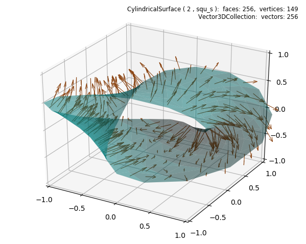
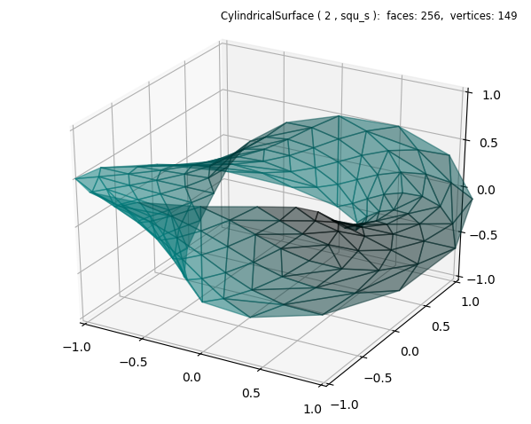

.. _facenormals:

***************************
Face Normals Vector Field
***************************

.. literalinclude:: source/ex_facenormals.py
   :language: python
   :emphasize-lines: 25,40

In the above script, edge color was set to transparent after shading. The assignment of
color in the object constructor does not make an alpha channel assignment
for the edge colors.  If edge color is not assigned to be transparent, it will be displayed.
Commenting out the highlighted lines in the above script produces the following figure.
Notice that shading will be applied to the edges, as shown below.

