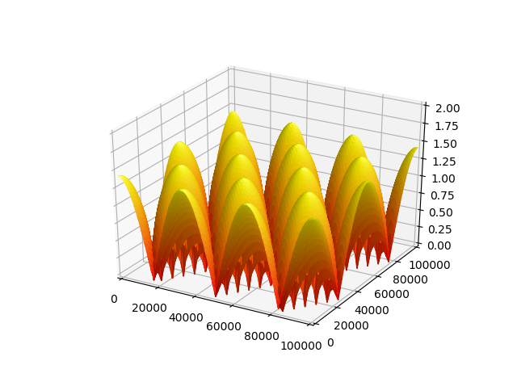

.. _normalize:

**************************************
Normalization and Scaling
**************************************

S3Dlib object defaults to a domain in the range [-1,1].  In this example, first the domain is changed to [0,1].
The surface x and y coordinates are then scaled and then plotted in a scaled coordinate view.

This example is based on the function used in the
`Matplotlib <https://matplotlib.org/3.1.1/gallery/mplot3d/offset.html#sphx-glr-gallery-mplot3d-offset-py>`_
example.

.. literalinclude:: source/ex_normalize.py
   :language: python

