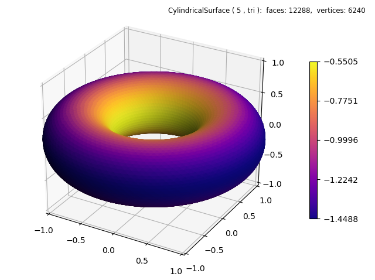

.. _radial_torus:

***********************
Radial Color Mapped
***********************

.. literalinclude:: source/ex_radial_torus.py
   :language: python
   :emphasize-lines: 21

.. note::

   In the highlighted line, the lambda function uses the negative of the radial coordinate for
   color mapping.  This effectively uses a color map that is reversed.

