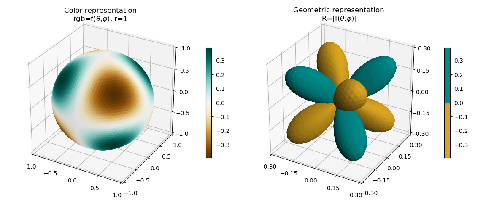
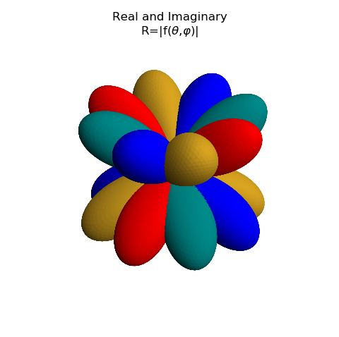
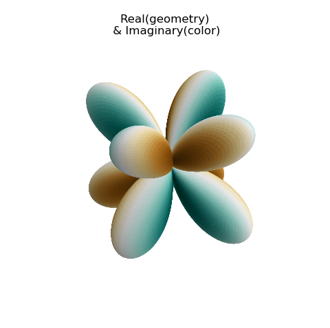

.. _sph_harm:

.. role::  raw-html(raw)
    :format: html

****************************************************************************
Two methods of Representing :raw-html:`f(&theta; , &phi;)`
****************************************************************************

These are plots of the Spherical Harmonics surface using the special function from the
`SciPy <https://docs.scipy.org/doc/scipy/reference/generated/scipy.special.sph_harm.html#scipy.special.sph_harm>`_ 
library.  This example demonstrates the object oriented approach to constructing surfaces,
as opposed to using the conventional Matplotlib method shown in the
`Visualizing the spherical harmonics <https://scipython.com/book/chapter-8-scipy/examples/visualizing-the-spherical-harmonics/>`_ 
example.

In this example, the functional definition is clearly identified in the code
and only two lines of code are needed to define the surface object.  Then, one
line of code to add the surface to the plot.  These lines are highlighted in
the code used to construct the plot.

Real Component
====================================================================================================

.. image:: images/sph_harm_r.png
   :class: sphx-glr-single-img

.. literalinclude:: source/ex_sph_harm_r.py
   :language: python
   :emphasize-lines: 26,27,51

Imaginary Component
====================================================================================================

The imaginary component of the value is easily shown by simply changing the function definition
and the colors, as shown in the highlighted lines below.

.. literalinclude:: source/ex_sph_harm_i.py
   :language: python
   :lines: 10-32
   :emphasize-lines: 6,15,17

Combined Components
====================================================================================================

Both real and imaginary parts can be displayed using the geometric representation by just
adding the two surfaces together as one surface, then add the combined surface to the figure.

.. literalinclude:: source/ex_sph_harm_ri.py
   :language: python

Here, one function definition is used with the additional parameter indicating whether the real
or imaginary component of the spherical harmonic function is to be returned.

This is just a demo and only shown as a demonstration of capabilities.   This may be visually
incomprehensible when multiple surfaces are combined as this figure demonstrates.

By using the real component for the geometry and the imaginary component for color, these
may also be combined.  This is one of the methods used for  :ref:`complex` example.

For this example, only the surface object was changed as:

.. literalinclude:: source/ex_sph_harm_ri2.py
   :language: python
   :lines: 26-35

Again, this is only a demo and leads to a difficult interpretation. In particular, the 
positive and negative values of the real component are hidden.  By separating the real
components into two surfaces, as was done with :ref:`complex_planar` example, two different
cmaps could be used.  But then the imaginary color visualization would get confusing. 
Bottom line, KISS.

