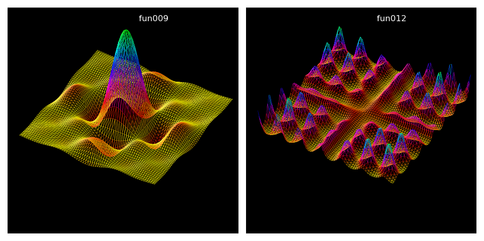

.. _surface_edges:

****************************
Wireframe Plots
****************************

.. image:: images/surface_edges.png
   :class: sphx-glr-single-img

Mapping function are similarly defined as in the
`Geeks3D <https://www.geeks3d.com/20130702/3d-surfaces-plots-equations-examples-glslhacker-demo-opengl-glsl/3/>`_
examples.  Here, the only difference is the use of Numpy arrays.

.. literalinclude:: source/ex_surface_edges.py
   :language: python

Further examples of viewing only edges are shown below.  Surface objects were identically constructed
as in the previous script with only changes made to the function references.

.. literalinclude:: source/ex_surface_edges2.py
   :language: python
   :lines: 8-25

