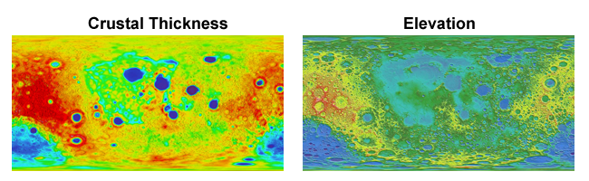

.. _cmap_mod:

**************************************
Data Colormap Modification
**************************************

.. image:: images/cmap_mod.png
   :class: sphx-glr-single-img

This example uses data from two images, both using the hue component to indicate value.
For the 'crustal thickness' image:

#. hue was used to geometrically map to elevation.
#. elevation was used to map a sequential colormap.
#. elevation was then removed with a geometric map to a uniform radius.

Note that this technique of changing
the colormap assumes that the hue in the original image is linear with 
the data values.

Now that the surface was colored, the 'elevation' image was used for mapping the geometry using hue.
For both images, the color component was used by setting *cref* to 'h'.
The *hzero* parameter was set so that the start values increase in a negative
direction going from blue to cyan, green, red, etc.

Using a sequential color map, along with a shaded geometry, provides a clear representation of
two different data sets in three dimensions.  This is particularly useful when printing in
a grey scale.

.. literalinclude:: source/ex_cmap_mod.py
   :language: python

