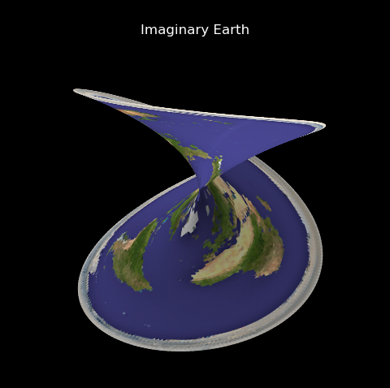

.. _imaginary_earth:

**************************************
Imaginary Earth
**************************************

This is just a simple example of image mapping, then geometric mapping.  The geometry
map uses the function from :ref:`complex` example.

.. literalinclude:: source/ex_imaginary_earth.py
   :language: python

