.. _example:

***************
Examples
***************

These examples demonstrate the various capabilities using S3Dlib. Click on any image to see
the full image, source code and discussion describing construction techniques.
Since many of these examples also are annotated, in many instances, more code is used
for the annotation than creating the surface.

Numerous examples use a *rez* with a value from 5 to 7.  Although such higher values
reduce the interactive response time during development, the plots are clearer and more detailed.  This is
particulary the case for surfaces with higher curvatures or mapped images.
Script development is generally done at a lower *rez* and 
then increased for producing final static or animation images.

Introductory tutorials to get started using S3Dlib are found in the :ref:`tutorial` pages.
More detailed explanations of objects and functions are given in the :ref:`guides` pages.

Various surfaces use functional mapping and, if available, references are given
regarding the functions in the specific example page.
Source data for these examples are found in :ref:`data_reference` page.

.. toctree::
   :hidden:

   referenceData.rst

.. _matplot_examples:

Matplotlib Examples
=========================================================================================

The following examples are based on examples in the
`3D plotting Gallery <https://matplotlib.org/3.1.1/gallery/index.html#d-plotting>`_
of Matplotlib. Several examples first illustrate the geometries without using a color map for z-coordinate values.
The examples are then color mapped similar to the Matplotlib example with the simple addition of
one code statement.

.. toctree::
   :hidden:

   matplot_ex/demo3D.rst

.. raw:: html

    <a href="matplot_ex/demo3D.html">
    

    A very basic plot of a 3D surface using a solid color.

.. only:: html

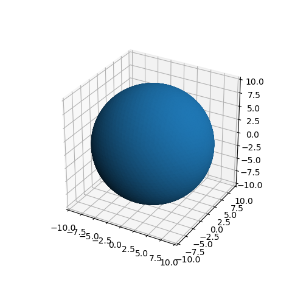

3D Surface

.. raw:: html

    
</a>

.. toctree::
   :hidden:

   matplot_ex/cyl_coor.rst

.. raw:: html

    <a href="matplot_ex/cyl_coor.html">
    

    Polar surface in native polar coordinates.

.. only:: html

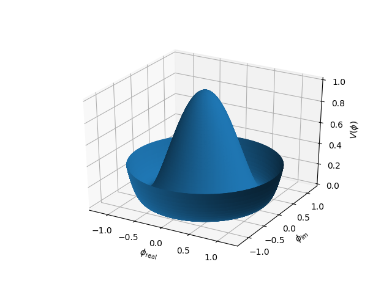

3D Surface in Polar Coordinates

.. raw:: html

    
</a>

.. toctree::
   :hidden:

   matplot_ex/wave.rst

.. raw:: html

    <a href="matplot_ex/wave.html">
    

     Solid color surface with shading for topological perception.

.. only:: html

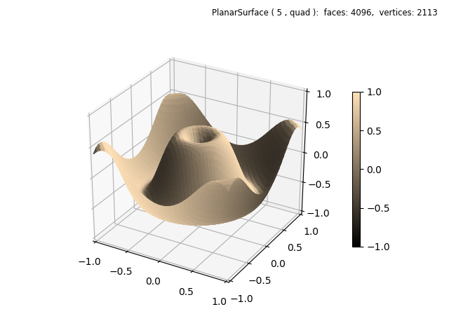

Shading

.. raw:: html

    
</a>

.. toctree::
   :hidden:

   matplot_ex/pringle.rst

.. raw:: html

    <a href="matplot_ex/pringle.html">
    

     Color mapping applied to surface normals for topological perception.

.. only:: html

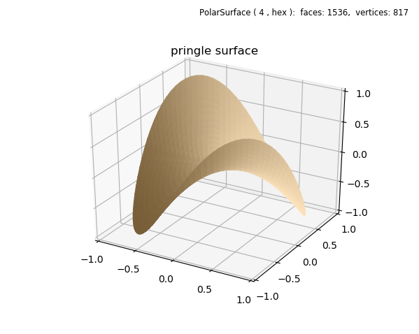

Color Mapping Normals

.. raw:: html

    
</a>

.. toctree::
   :hidden:

   matplot_ex/twistribbon.rst

.. raw:: html

    <a href="matplot_ex/twistribbon.html">
    

     Matplotlib example using cylindrical coordinates.

.. only:: html

.. image:: matplot_ex/images/twistribbon.png
   :class: docfig

Cylindrical Coordinates

.. raw:: html

    
</a>

.. toctree::
   :hidden:

   matplot_ex/mp_wire.rst

.. raw:: html

    <a href="matplot_ex/mp_wire.html">
    

     Use of the surface edge property to construct a wire frame plot from a datagrid.

.. only:: html

.. image:: matplot_ex/images/mp_wire.png
   :class: docfig

Datagrid Wireframe Plot

.. raw:: html

    
</a>

.. toctree::
   :hidden:

   matplot_ex/wireframe.rst

.. raw:: html

    <a href="matplot_ex/wireframe.html">
    

    Comparison among functional, datagrid and meshgrid methods for constructing wireframe plots.

.. only:: html

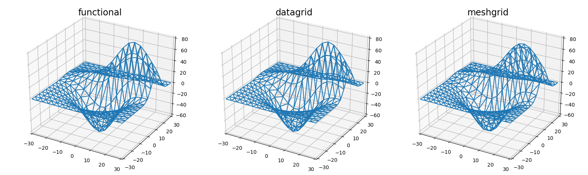

Functional, Datagrid and Meshgrid wireframe plots

.. raw:: html

    
</a>

.. toctree::
   :hidden:

   matplot_ex/jacksboro.rst

.. raw:: html

    <a href="matplot_ex/jacksboro.html">
    

     Use of a topographic data set to create a 3D visualization.

.. only:: html

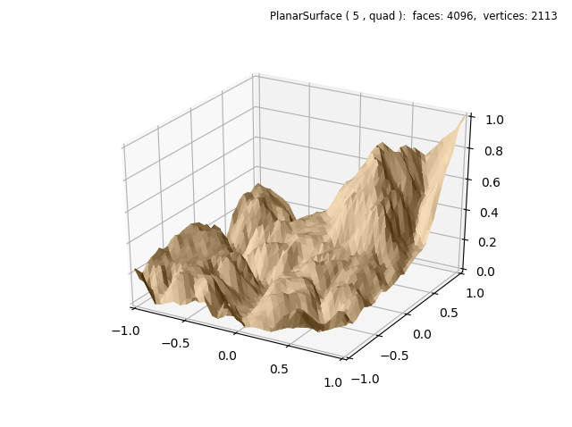

Datagrid Geometry

.. raw:: html

    
</a>

.. toctree::
   :hidden:

   matplot_ex/data_mesh.rst

.. raw:: html

    <a href="matplot_ex/data_mesh.html">
    

    Comparison between Datagrid and Meshgrid surface representations.

.. only:: html

.. image:: matplot_ex/images/data_mesh.png
   :class: docfig

Datagrid and Meshgrid surfaces

.. raw:: html

    
</a>

.. raw:: html

    

.. _functional-maps:

Function Plots
=========================================================================================

The following are examples of creating surface color and geometry using functional mapping.

.. toctree::
   :hidden:

   functional/hw_example.rst

.. raw:: html

    <a href="functional/hw_example.html">
    

    Simple example of multiple operations and settings for surface plotting.

.. only:: html

.. image:: functional/images/hw_example.png
   :class: docfig

Hello World Example

.. raw:: html

    
</a>

.. toctree::
   :hidden:

   functional/cube.rst

.. raw:: html

    <a href="functional/cube.html">
    

    Construction of surfaces from vertex and face arrays.

.. only:: html

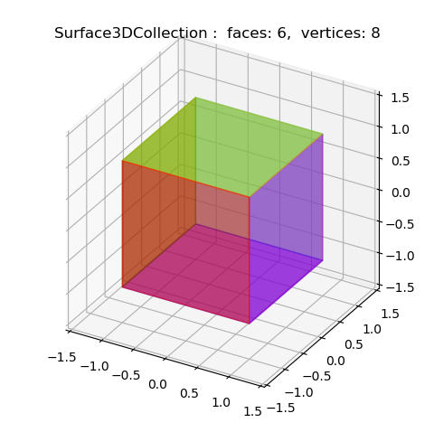

Base Class Surface

.. raw:: html

    
</a>

.. toctree::
   :hidden:

   functional/funcplots.rst

.. raw:: html

    <a href="functional/funcplots.html">
    

    Basic plotting demonstrated with multiple functions.

.. only:: html

.. image:: functional/images/funcplots.png
   :class: docfig

Function Plots, z = f(x,y) 

.. raw:: html

    
</a>

.. toctree::
   :hidden:

   functional/cyclic_mirror.rst

.. raw:: html

    <a href="functional/cyclic_mirror.html">
    

    Usage comparison between cyclic versus mirrored colormaps.

.. only:: html

.. image:: functional/images/hsv_torus.png
   :class: docfig

Cyclic and Mirrored Colormaps

.. raw:: html

    
</a>

.. toctree::
   :hidden:

   functional/radial_torus.rst

.. raw:: html

    <a href="functional/radial_torus.html">
    

    Color map used to indicate radial position.

.. only:: html

.. image:: functional/images/radial_torus.png
   :class: docfig

Radial Color Mapped

.. raw:: html

    
</a>

.. toctree::
   :hidden:

   functional/screw.rst

.. raw:: html

    <a href="functional/screw.html">
    

    Extending the angular coordinate domain to &plusmn;&pi;.

.. only:: html

.. image:: functional/images/screw.png
   :class: docfig

Sliced Polar Surface

.. raw:: html

    
</a>

.. toctree::
   :hidden:

   functional/normalize.rst

.. raw:: html

    <a href="functional/normalize.html">
    

    Surface domain is changed from [-1,1] to [0,1], scaled, and then shown on scaled axis.

.. only:: html

.. image:: functional/images/normalize.png
   :class: docfig

Normalization and Scaling

.. raw:: html

    
</a>

.. toctree::
   :hidden:

   functional/sph_harm.rst

.. raw:: html

    <a href="functional/sph_harm.html">
    

     Alternative method of representing a function of two variables in spherical coordinates. 

.. only:: html

.. image:: functional/images/sph_harm_r.png
   :class: docfig

.. raw:: html

   Two Methods of Representing f(&theta;,&phi;)

.. raw:: html

    
</a>

.. toctree::
   :hidden:

   functional/complex.rst

.. raw:: html

    <a href="functional/complex.html">
    

     Two methods of visualizing complex numbers using either a polar, planar or cylindrical surface.

.. only:: html

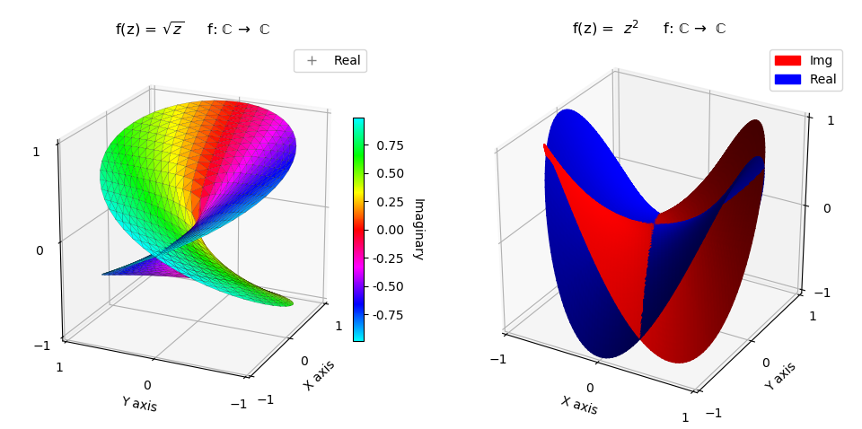

Complex Number Representation, Geometry and Colormap

.. raw:: html

    
</a>

.. toctree::
   :hidden:

   functional/complex_hsv.rst

.. raw:: html

    <a href="functional/complex_hsv.html">
    

     Two methods of visualizing complex numbers using color attributes of hue and value.

.. only:: html

.. image:: functional/images/complex_hsv.png
   :class: docfig

Complex Number Representation, Hue and Value

.. raw:: html

    
</a>

.. toctree::
   :hidden:

   functional/facenormals.rst

.. raw:: html

    <a href="functional/facenormals.html">
    

    Demonstration of visualizing the normals of a surface object.

.. only:: html

.. image:: functional/images/facenormals.png
   :class: docfig

Face Normals Vector Field

.. raw:: html

    
</a>

.. toctree::
   :hidden:

   functional/tube_disp.rst

.. raw:: html

    <a href="functional/tube_disp.html">
    

    Visualization of vibration modes of a cylinder.

.. only:: html

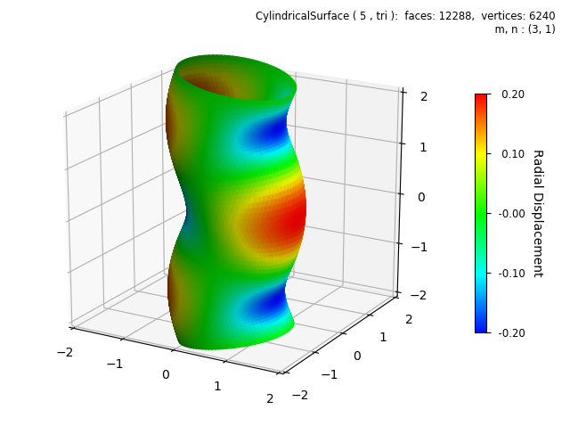

Surface Displacements in Cylindrical Coordinates

.. raw:: html

    
</a>

.. toctree::
   :hidden:

   functional/tube_disp2.rst

.. raw:: html

    <a href="functional/tube_disp2.html">
    

    Visualization of displacements of a vibrating cylinder.

.. only:: html

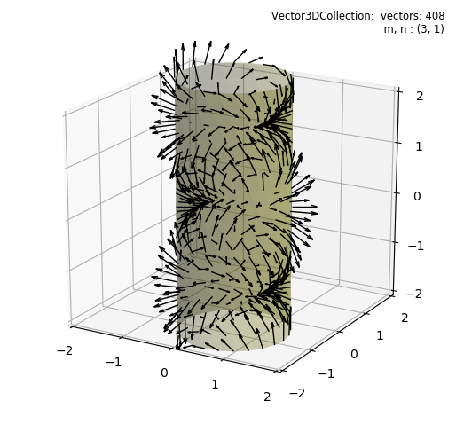

Vector Field in Cylindrical Coordinates

.. raw:: html

    
</a>

.. toctree::
   :hidden:

   functional/cat2heli_disp.rst

.. raw:: html

    <a href="functional/cat2heli_disp.html">
    

    Displacement of transitions from one parametric surface to another surface.

.. only:: html

.. image:: functional/images/cat2heli_disp.png
   :class: docfig

Surface Displacement Vector Field

.. raw:: html

    
</a>

.. toctree::
   :hidden:

   functional/dini.rst

.. raw:: html

    <a href="functional/dini.html">
    

    Using a polar surface object for visualizing parametric equations.

.. only:: html

.. image:: functional/images/dini.png
   :class: docfig

Polar Coordinates to XYZ

.. raw:: html

    
</a>

.. toctree::
   :hidden:

   functional/bour.rst

.. raw:: html

    <a href="functional/bour.html">
    

    Another example of using a polar surface object for visualizing parametric equations.

.. only:: html

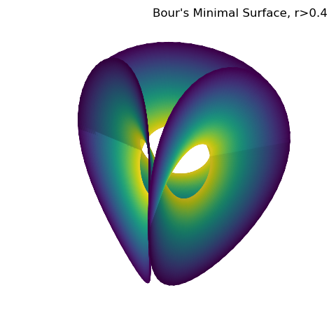

Polar Coordinates to XYZ, 2

.. raw:: html

    
</a>

.. toctree::
   :hidden:

   functional/roman.rst

.. raw:: html

    <a href="functional/roman.html">
    

    Using a spherical surface object for visualizing parametric equations.

.. only:: html

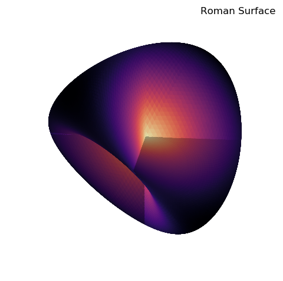

Spherical Coordinates to XYZ

.. raw:: html

    
</a>

.. toctree::
   :hidden:

   functional/klein_bottle.rst

.. raw:: html

    <a href="functional/klein_bottle.html">
    

    Simple example of a complex surface geometry.

.. only:: html

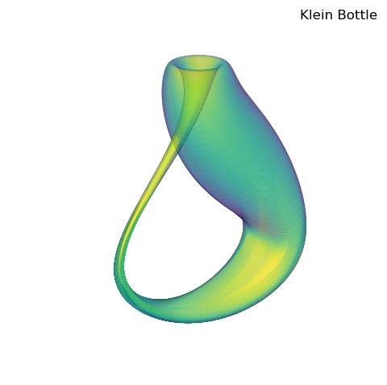

Klein Bottle, Spherical to XYZ

.. raw:: html

    
</a>

.. toctree::
   :hidden:

   functional/klein_figure8.rst

.. raw:: html

    <a href="functional/klein_figure8.html">
    

    Simple example of a complex surface geometry.

.. only:: html

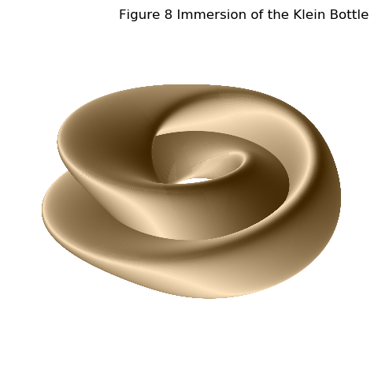

Figure 8 Klein Bottle

.. raw:: html

    
</a>

.. toctree::
   :hidden:

   functional/transform.rst

.. raw:: html

    <a href="functional/transform.html">
    

    Transformed surface showing both origin and transformed coordinates.

.. only:: html

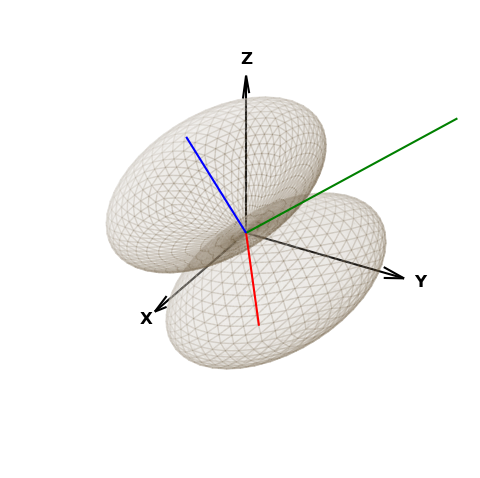

Coordinate Transform

.. raw:: html

    
</a>

.. toctree::
   :hidden:

   functional/twisted_torus.rst

.. raw:: html

    <a href="functional/twisted_torus.html">
    

    Demonstration of operation order on color visualization.

.. only:: html

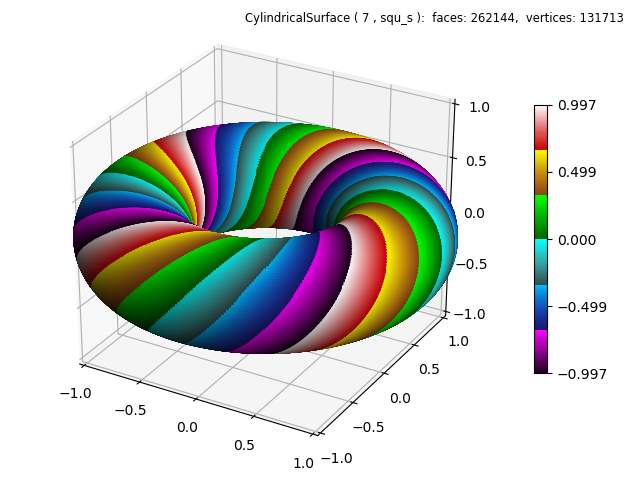

Order of Operation

.. raw:: html

    
</a>

.. toctree::
   :hidden:

   functional/color_tri.rst

.. raw:: html

    <a href="functional/color_tri.html">
    

    Visualizing the subtle geometric variations using a normalized color map.

.. only:: html

.. image:: functional/images/color_tri.png
   :class: docfig

Base Face Variations

.. raw:: html

    
</a>

.. toctree::
   :hidden:

   functional/triple.rst

.. raw:: html

    <a href="functional/triple.html">
    

    Applying combined surface coloring methods to emphasize geometry.

.. only:: html

.. image:: functional/images/triple.png
   :class: docfig

Cmapped Normals, Shading and Highlighting

.. raw:: html

    
</a>

.. toctree::
   :hidden:

   functional/orange_peel.rst

.. raw:: html

    <a href="functional/orange_peel.html">
    

    Demonstrations of applying a surface texture using geometry or color.

.. only:: html

.. image:: functional/images/orange_peel.png
   :class: docfig

Surface Texture

.. raw:: html

    
</a>

.. toctree::
   :hidden:

   functional/knot.rst

.. raw:: html

    <a href="functional/knot.html">
    

    Applying geometric mapping to an already mapped surface.

.. only:: html

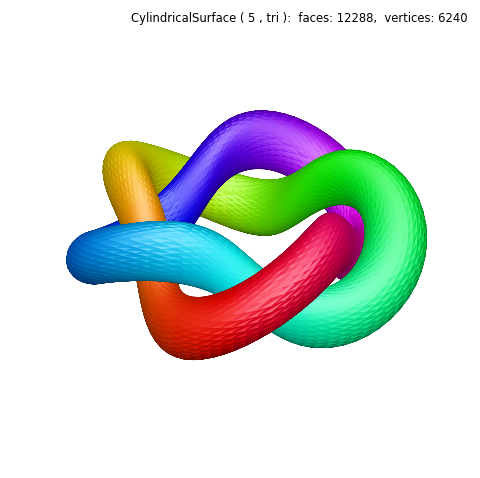

Multiple Geometric Maps

.. raw:: html

    
</a>

.. toctree::
   :hidden:

   functional/intermediate.rst

.. raw:: html

    <a href="functional/intermediate.html">
    

    Surface creation functions for further mapping.

.. only:: html

.. image:: functional/images/intermediate.png
   :class: docfig

Intermediate Surfaces

.. raw:: html

    
</a>

.. toctree::
   :hidden:

   functional/star.rst

.. raw:: html

    <a href="functional/star.html">
    

    An intermediate surface further mapped.

.. only:: html

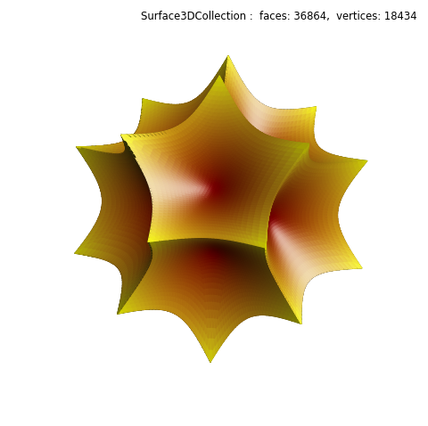

Multiple Geometric Maps 2

.. raw:: html

    
</a>

.. toctree::
   :hidden:

   functional/candy.rst

.. raw:: html

    <a href="functional/candy.html">
    

    Creating and using a compounded binary color map.

.. only:: html

.. image:: functional/images/candy.png
   :class: docfig

Compound Color Maps

.. raw:: html

    
</a>

.. toctree::
   :hidden:

   functional/surface_edges.rst

.. raw:: html

    <a href="functional/surface_edges.html">
    

    Simple plot with edges emphasized instead of surface faces.

.. only:: html

.. image:: functional/images/surface_edges.png
   :class: docfig

Wireframe Plots

.. raw:: html

    
</a>

.. toctree::
   :hidden:

   functional/RGB_sphere.rst

.. raw:: html

    <a href="functional/RGB_sphere.html">
    

    Using geometric mapping into RGB color space.

.. only:: html

.. image:: functional/images/RGB_sphere.png
   :class: docfig

Functional RGB Color Mapping

.. raw:: html

    
</a>

.. toctree::
   :hidden:

   functional/HSV_washer.rst

.. raw:: html

    <a href="functional/HSV_washer.html">
    

    Using geometric mapping into HSV color space.

.. only:: html

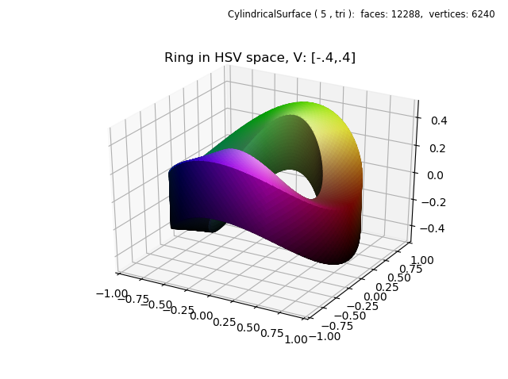

Functional HSV Color Mapping

.. raw:: html

    
</a>

.. toctree::
   :hidden:

   functional/param_set.rst

.. raw:: html

    <a href="functional/param_set.html">
    

    Multiple plots using different values for a function parameter.

.. only:: html

.. image:: functional/images/param_set.png
   :class: docfig

Parametric Set

.. raw:: html

    
</a>

.. toctree::
   :hidden:

   functional/param_set2.rst

.. raw:: html

    <a href="functional/param_set2.html">
    

    Use of a diverging colormap.

.. only:: html

.. image:: functional/images/param_set2.png
   :class: docfig

Parametric Set 2

.. raw:: html

    
</a>

.. toctree::
   :hidden:

   functional/four_levels.rst

.. raw:: html

    <a href="functional/four_levels.html">
    

    Two methods of selecting four values from a Cmap using angular position.

.. only:: html

.. image:: functional/images/four_levels.png
   :class: docfig

Segmented Cmap Operation

.. raw:: html

    
</a>

.. toctree::
   :hidden:

   functional/Lab_space.rst

.. raw:: html

    <a href="functional/Lab_space.html">
    

    Using native coordinates, map surfaces into RGB, HSV and Lab color spaces.

.. only:: html

.. image:: functional/images/Lab_space.png
   :class: docfig

Color Space

.. raw:: html

    
</a>

.. toctree::
   :hidden:

   functional/hirez.rst

.. raw:: html

    <a href="functional/hirez.html">
    

    Basic functional plot requiring a high rez visualization.

.. only:: html

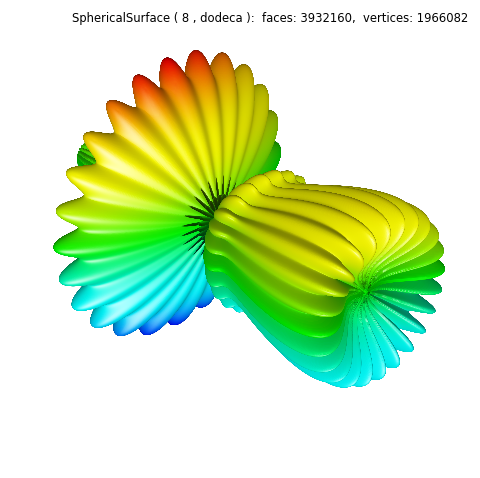

High Resolution Example

.. raw:: html

    
</a>

.. raw:: html

    

.. _image-maps:

Image Mapping
=========================================================================================

Color data values from images are applied to control the surface color and geometry in
the following examples.  

.. toctree::
   :hidden:

   imagemap/wmap_sphere.rst

.. raw:: html

    <a href="imagemap/wmap_sphere.html">
    

    Mapping a 2D image onto a spherical surface.

.. only:: html

.. image:: imagemap/images/wmap_sphere.png
   :class: docfig

Spherical Image Mapping

.. raw:: html

    
</a>

.. toctree::
   :hidden:

   imagemap/mars_cyl.rst

.. raw:: html

    <a href="imagemap/mars_cyl.html">
    

    Mapping a 2D image onto a disk and cylinder.

.. only:: html

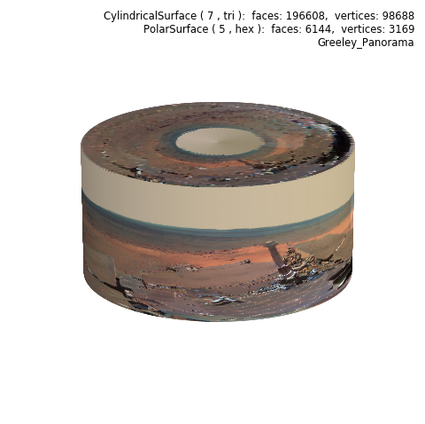

Polar and Cylindrical Image Mapping

.. raw:: html

    
</a>

.. toctree::
   :hidden:

   imagemap/stinkbug.rst

.. raw:: html

    <a href="imagemap/stinkbug.html">
    

    Image mapped to a section of a spherical surface.

.. only:: html

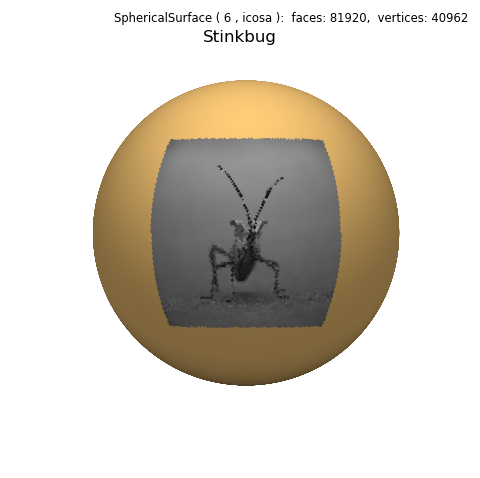

Mapping to a Viewport

.. raw:: html

    
</a>

.. toctree::
   :hidden:

   imagemap/retinal_scan.rst

.. raw:: html

    <a href="imagemap/retinal_scan.html">
    

    Image mapped to a section of a spherical surface which is then geometrically mapped.

.. only:: html

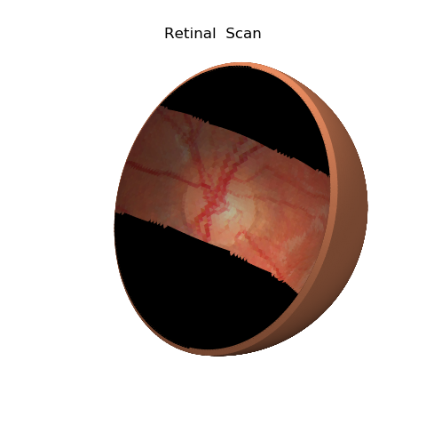

Function and Image Mapping

.. raw:: html

    
</a>

.. toctree::
   :hidden:

   imagemap/image_to_geom.rst

.. raw:: html

    <a href="imagemap/image_to_geom.html">
    

    Two examples of geometric mapping using either Hue or Value obtained from an image.

.. only:: html

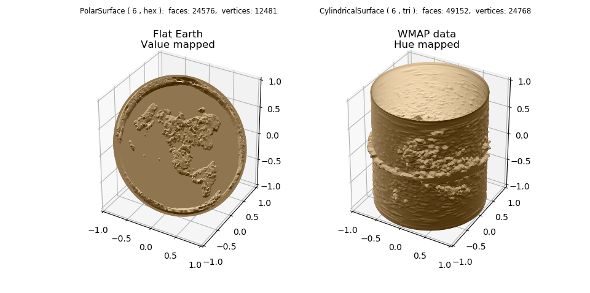

Image Geometric Mapping

.. raw:: html

    
</a>

.. toctree::
   :hidden:

   imagemap/earth_shaded.rst

.. raw:: html

    <a href="imagemap/earth_shaded.html">
    

    Image Color mapping and Geometry mapping are combined with additional shading.

.. only:: html

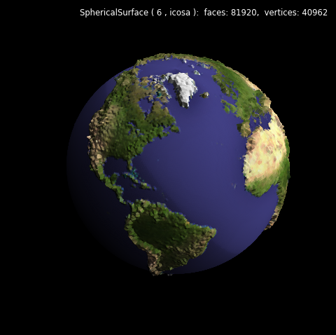

Geometric and Color Image Mapping

.. raw:: html

    
</a>

.. toctree::
   :hidden:

   imagemap/cmap_mod.rst

.. raw:: html

    <a href="imagemap/cmap_mod.html">
    

    Image data is translated from one colormap to another using geometric mapping.

.. only:: html

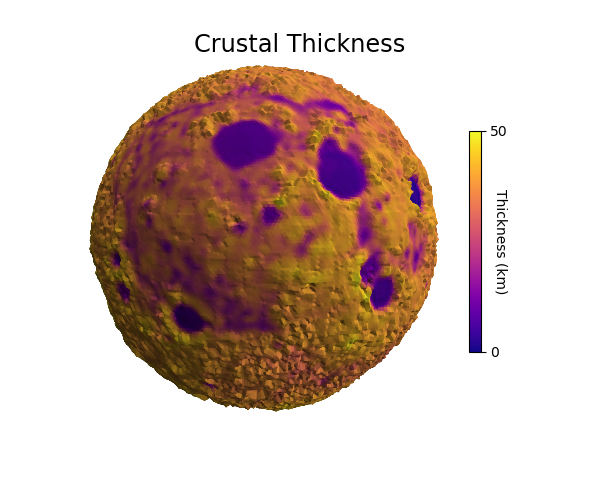

Data Colormap Modification

.. raw:: html

    
</a>

.. toctree::
   :hidden:

   imagemap/imaginary_earth.rst

.. raw:: html

    <a href="imagemap/imaginary_earth.html">
    

    Just for fun.

.. only:: html

.. image:: imagemap/images/imaginary_earth.png
   :class: docfig

Imaginary Earth

.. raw:: html

    
</a>

.. raw:: html

    

.. _datagrid-surfaces:

Datagrid Surfaces
=========================================================================================

Values from datagrids are applied to control the surface color and geometry in the
following examples.  The first six examples use the same data set and show the analogy
between an image and datagrid, when compared to the *Image Mapping* examples above.

.. toctree::
   :hidden:

   datagridmap/jacks_sphere.rst

.. raw:: html

    <a href="datagridmap/jacks_sphere.html">
    

    Mapping a 2D datagrid onto a spherical surface.

.. only:: html

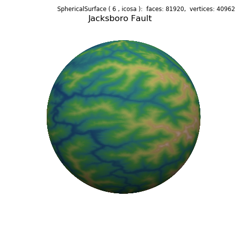

Spherical Datagrid Mapping

.. raw:: html

    
</a>

.. toctree::
   :hidden:

   datagridmap/jacks_cyl.rst

.. raw:: html

    <a href="datagridmap/jacks_cyl.html">
    

    Mapping a 2D datagrid onto a disk and cylinder.

.. only:: html

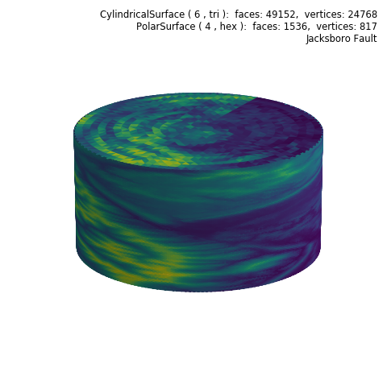

Polar and Cylindrical Datagrid Mapping

.. raw:: html

    
</a>

.. toctree::
   :hidden:

   datagridmap/jacks_viewport.rst

.. raw:: html

    <a href="datagridmap/jacks_viewport.html">
    

    Datagrid mapped to a section of a spherical surface.

.. only:: html

.. image:: datagridmap/images/jacks_viewport.png
   :class: docfig

Datagrid Mapping to a Viewport

.. raw:: html

    
</a>

.. toctree::
   :hidden:

   datagridmap/datagrid_to_geom.rst

.. raw:: html

    <a href="datagridmap/datagrid_to_geom.html">
    

    Example of datagrid mapping to polar and cylindrical surface.

.. only:: html

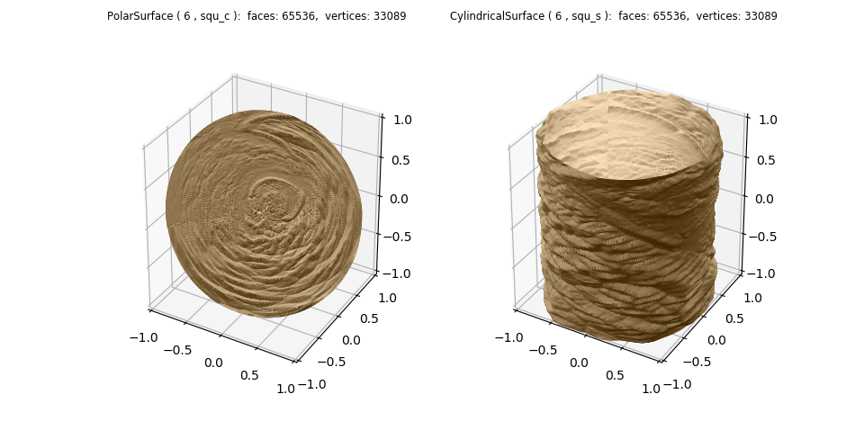

Datagrid Geometric Mapping

.. raw:: html

    
</a>

.. toctree::
   :hidden:

   datagridmap/jacks_shaded.rst

.. raw:: html

    <a href="datagridmap/jacks_shaded.html">
    

    Datagrid color and geometry mapping are combined with shading.

.. only:: html

.. image:: datagridmap/images/jacks_shaded.png
   :class: docfig

Geometric and Color Datagrid Mapping

.. raw:: html

    
</a>

.. toctree::
   :hidden:

   datagridmap/jacks_shaded2.rst

.. raw:: html

    <a href="datagridmap/jacks_shaded2.html">
    

    Datagrid color and geometry mapping are combined with shading.

.. only:: html

.. image:: datagridmap/images/jacks_shaded2.png
   :class: docfig

Geometric and Color Datagrid Mapping 2

.. raw:: html

    
</a>

.. toctree::
   :hidden:

   datagridmap/mandelbrot.rst

.. raw:: html

    <a href="datagridmap/mandelbrot.html">
    

    Just for fun.  A visualization tool wouldn't be complete without a Mandelbrot demo ;-)

.. only:: html

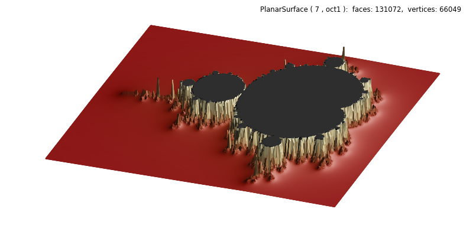

Datagrid Alternative to Image Construction

.. raw:: html

    
</a>

.. raw:: html

    

.. _composite-surfaces:

Composite Surfaces
=========================================================================================

Composite surfaces are those constructed by combining several surface objects into one object.
Operations of color and geometric mapping can be applied before or after the individual
objects are combined to form the final single object.

.. toctree::
   :hidden:

   composite/chainlinks.rst

.. raw:: html

    <a href="composite/chainlinks.html">
    

    Simple example of combining two surfaces to form one surface.

.. only:: html

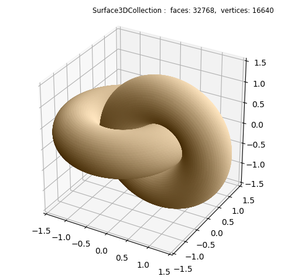

Surface Addition

.. raw:: html

    
</a>

.. toctree::
   :hidden:

   composite/clipping.rst

.. raw:: html

    <a href="composite/clipping.html">
    

    Diplaying sections of the surface.

.. only:: html

.. image:: composite/images/clipping.png
   :class: docfig

Clipping a Surface

.. raw:: html

    
</a>

.. toctree::
   :hidden:

   composite/dipole.rst

.. raw:: html

    <a href="composite/dipole.html">
    

    One surface constructed from multiple surfaces using a parametric function .

.. only:: html

.. image:: composite/images/dipole.png
   :class: docfig

Parametric Set of Surfaces

.. raw:: html

    
</a>

.. toctree::
   :hidden:

   composite/cat2heli.rst

.. raw:: html

    <a href="composite/cat2heli.html">
    

    Combining two surfaces, both based on a single parametric function.

.. only:: html

.. image:: composite/images/cat2heli.png
   :class: docfig

Parametric Set of Surfaces 2

.. raw:: html

    
</a>

.. toctree::
   :hidden:

   composite/nacl.rst

.. raw:: html

    <a href="composite/nacl.html">
    

    Composite of similar surfaces translated to multiple locations.

.. only:: html

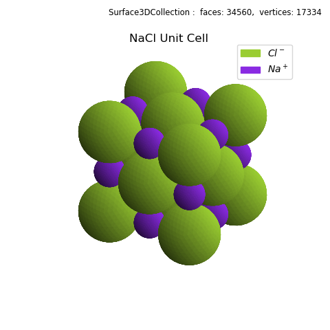

Sub-surface Translation

.. raw:: html

    
</a>

.. toctree::
   :hidden:

   composite/sliced_earth.rst

.. raw:: html

    <a href="composite/sliced_earth.html">
    

    Spherical and Polar surfaces are separately image mapped and then combined.

.. only:: html

.. image:: composite/images/sliced_earth.png
   :class: docfig

Composite surface composed of different sub-surface types

.. raw:: html

    
</a>

.. toctree::
   :hidden:

   composite/saturn.rst

.. raw:: html

    <a href="composite/saturn.html">
    

    Spherical and Cylindrical surfaces are separately image mapped and then combined.

.. only:: html

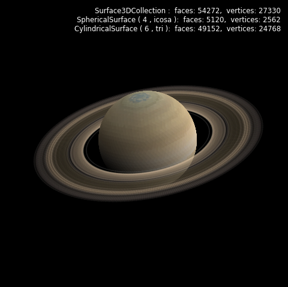

Alpha Channel Adjustments

.. raw:: html

    
</a>

.. toctree::
   :hidden:

   composite/fullerene.rst

.. raw:: html

    <a href="composite/fullerene.html">
    

    Use of face coordinates to construct a multiple object surface.

.. only:: html

.. image:: composite/images/fullerene.png
   :class: docfig

Face Center Translation

.. raw:: html

    
</a>

.. toctree::
   :hidden:

   composite/double_helix.rst

.. raw:: html

    <a href="composite/double_helix.html">
    

    Map color to a surface, then a geometric operation.

.. only:: html

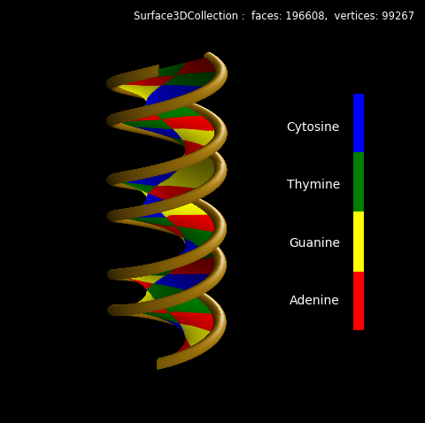

Angular 4-Color Color Map

.. raw:: html

    
</a>

.. toctree::
   :hidden:

   composite/avacado.rst

.. raw:: html

    <a href="composite/avacado.html">
    

    Just for fun.

.. only:: html

.. image:: composite/images/avacado.png
   :class: docfig

Texture Surface with Geometric Mapping

.. raw:: html

    
</a>

.. toctree::
   :hidden:

   composite/pycube.rst

.. raw:: html

    <a href="composite/pycube.html">
    

    Just for fun.

.. only:: html

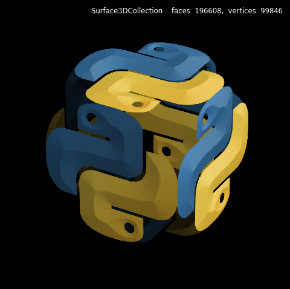

Composite of Copies

.. raw:: html

    
</a>

.. raw:: html

    

.. _data-plots:

Data Based Surfaces
=========================================================================================

Data is used to control the surface geometry and color in the following examples.
Surface geometry is then applied to color the data points in the scatter plots.

.. toctree::
   :hidden:

   data_surface/conf_ellip.rst

.. raw:: html

    <a href="data_surface/conf_ellip.html">
    

    Plot a standard deviations ellipsoids of a three-dimensional dataset.

.. only:: html

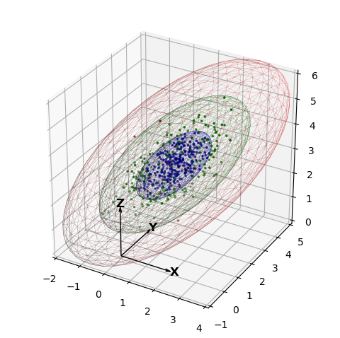

Standard Deviations Ellipsoids

.. raw:: html

    
</a>

.. toctree::
   :hidden:

   data_surface/pcnt.rst

.. raw:: html

    <a href="data_surface/pcnt.html">
    

    Visualization of the percent of outliers in a 3D dataset.

.. only:: html

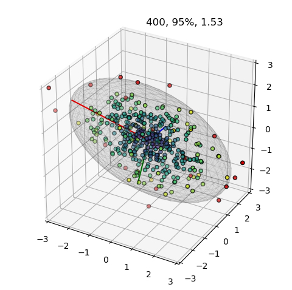

Percentile Visualization

.. raw:: html

    
</a>

.. toctree::
   :hidden:

   data_surface/pca.rst

.. raw:: html

    <a href="data_surface/pca.html">
    

    Visualization of principal components of a data set.

.. only:: html

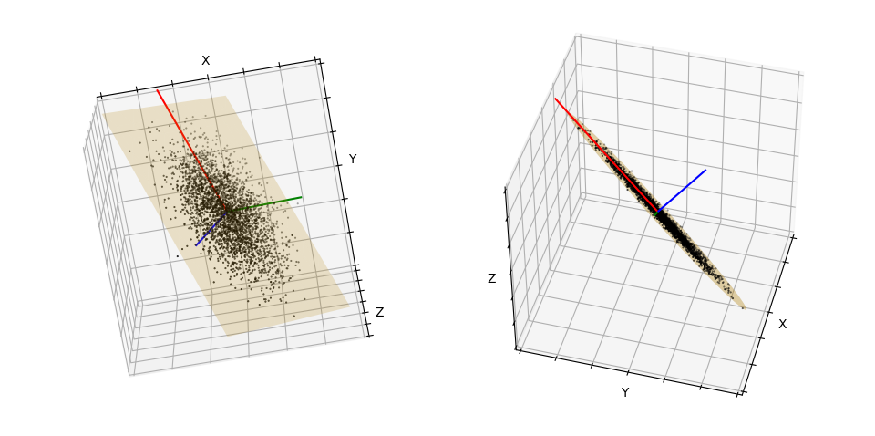

Principal Components Analysis

.. raw:: html

    
</a>

.. toctree::
   :hidden:

   data_surface/irisPCA.rst

.. raw:: html

    <a href="data_surface/irisPCA.html">
    

    Visualization surfaces for PCA of the iris dataset.

.. only:: html

.. image:: data_surface/images/irisPCA.png
   :class: docfig

PCA Iris Data-set

.. raw:: html

    
</a>

.. toctree::
   :hidden:

   data_surface/penguins.rst

.. raw:: html

    <a href="data_surface/penguins.html">
    

    Visualization surfaces for PCA of the Palmer penguin dataset.

.. only:: html

.. image:: data_surface/images/penguins.png
   :class: docfig

Penguin Data-set

.. raw:: html

    
</a>

.. raw:: html

    

.. _animations-plots:

Animations
=========================================================================================

Animations can be created by time varying geometry, color, and orientation.
The following examples were constructed using Matplotlib
`FuncAnimation <https://matplotlib.org/api/_as_gen/matplotlib.animation.FuncAnimation.html#matplotlib.animation.FuncAnimation>`_ .
Final conversion to animated png file format used
`ezGIF <https://ezgif.com/apng-maker>`_
with the temporary frame files generated by the *writer* in the call to *ani.save*.

.. toctree::
   :hidden:

   animations/anim_retinal_scan.rst

.. raw:: html

    <a href="animations/anim_retinal_scan.html">
    

    Azimuthal variation producing a stationary object perception with a rotating viewer.

.. only:: html

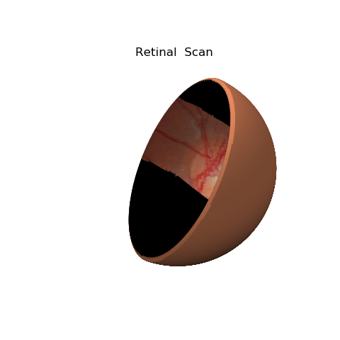

Figure View_init() Reset

.. raw:: html

    
</a>

.. toctree::
   :hidden:

   animations/anim_tube_disp.rst

.. raw:: html

    <a href="animations/anim_tube_disp.html">
    

    Geometric surface animation producing a vibrating cylinder.

.. only:: html

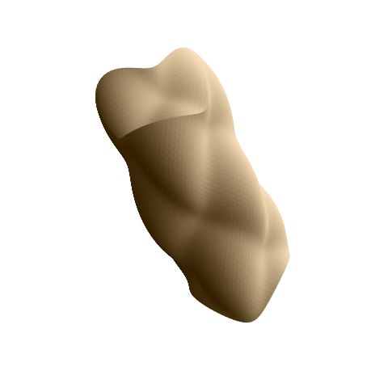

Time Sequence Animation

.. raw:: html

    
</a>

.. toctree::
   :hidden:

   animations/anim_cat2heli.rst

.. raw:: html

    <a href="animations/anim_cat2heli.html">
    

    Parametric changes between a catenoid to helicoid surface.

.. only:: html

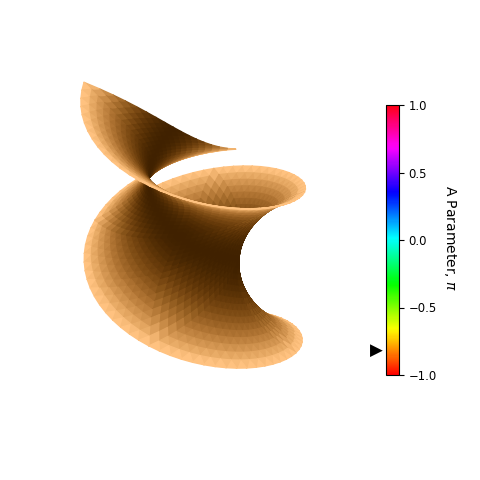

Parametric Animation

.. raw:: html

    
</a>

.. toctree::
   :hidden:

   animations/anim_earth_moon.rst

.. raw:: html

    <a href="animations/anim_earth_moon.html">
    

    Rotation of a 3D colored surface.

.. only:: html

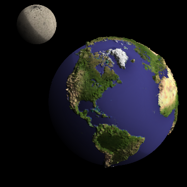

Transform and Shade

.. raw:: html

    
</a>

.. toctree::
   :hidden:

   animations/anim_bases.rst

.. raw:: html

    <a href="animations/anim_bases.html">
    

    Azimuthal variation producing a rotating object perception with a rotating view.

.. only:: html

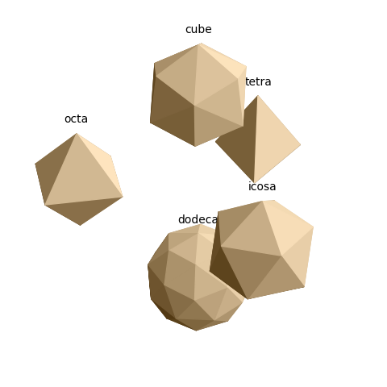

View_init() Azim Reset and Shading

.. raw:: html

    
</a>

.. toctree::
   :hidden:

   animations/anim_pycube.rst

.. raw:: html

    <a href="animations/anim_pycube.html">
    

    Elevation and azimuthal variation producing a rotating object perception with a rotating view.

.. only:: html

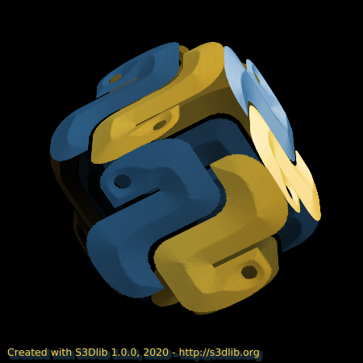

View_init() Elev and Azim Reset and Shading

.. raw:: html

    
</a>

.. toctree::
   :hidden:

   animations/anim_rgb_cube.rst

.. raw:: html

    <a href="animations/anim_rgb_cube.html">
    

    Producing a 3D solid object slicing perception in RGB color space.

.. only:: html

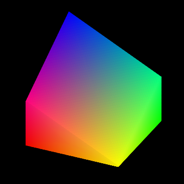

RGB Mapping

.. raw:: html

    
</a>

.. toctree::
   :hidden:

   animations/anim_hsv_cylinder.rst

.. raw:: html

    <a href="animations/anim_hsv_cylinder.html">
    

    Producing a 3D solid object slicing perception in HSV color space.

.. only:: html

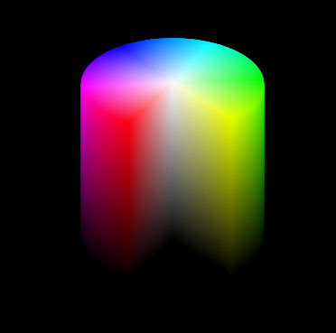

HSV Mapping

.. raw:: html

    
</a>

.. toctree::
   :hidden:

   animations/anim_lab_rot.rst

.. raw:: html

    <a href="animations/anim_lab_rot.html">
    

    Azimuthal variation producing a rotating object perception with a rotating view.

.. only:: html

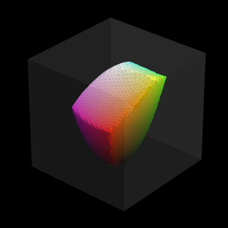

Lab Mapping

.. raw:: html

    
</a>

.. raw:: html

    

