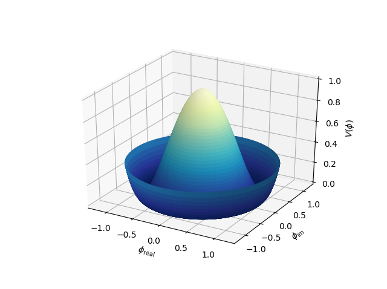

.. _cyl_coor:

*********************************
3D Surface in Polar Coordinates
*********************************

This is a comparison to the 
`3D surface with polar coordinates <https://matplotlib.org/3.1.1/gallery/mplot3d/surface3d_radial.html#sphx-glr-gallery-mplot3d-surface3d-radial-py>`_
Matplotlib example.

.. image:: images/cyl_coor.png
   :class: sphx-glr-single-img

.. literalinclude:: source/ex_cyl_coor.py
   :language: python
   :emphasize-lines: 19
 
Notice in this example, the function is actually 'defined' in polar coordinates
since PolarSurface object is defined with these native coordinates.
Alternative default surface color is applied using a colormap mapped in the z-coordinate
direction by uncommenting the highlighted line.
For the colormap, a lambda expression was used.  Alternatively, a function
could be defined explicitly as::

    def cmap_Z_dir(rtz) :
        r,t,z = rtz
    return z

and then that function used for the *map_cmap_from_op* argument.
When the cmap coloration is used, the following plot results:

