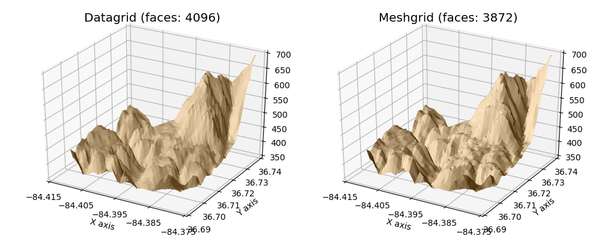
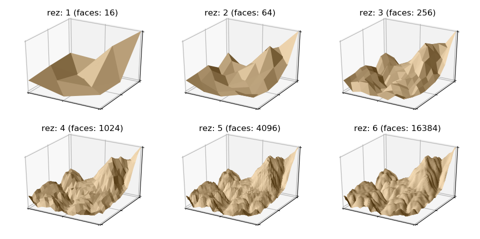

.. _data_mesh:

**************************************************
Datagrid and Meshgrid surfaces
**************************************************

This is a comparison between surfaces using a Datagrid or Meshgrid for 3D visualization
of data values at xy positions.

Both surfaces produced by the datagrid and meshgrid methods will produce similar visualizations
of the data for surfaces composed of comparably equal number of faces.  The only difference
being that the datagrid surface will tend to be smoother.

S3Dlib is based on normalized surfaces and, as a result when importing data, the surfaces
require coordinate scaling.  The method of coordinate scaling is dependent on whether
a datagrid or meshgrid is used.  These two script constructions exemplify the two methods.

Along with surface smoothing, the advantage of the datagrid method is that the data may be
used with mapping an image or mapping geometry on non-planar surfaces.

.. literalinclude:: source/ex_data_mesh.py
   :language: python
   :emphasize-lines: 31,34,35,37
 
Datagrid construction will smooth the surface as the surface resolution approaches the resolution
of the original data.  Continued increases in resolution will further smooth out the surface but
still preserved the overall surface shape set by the data.

.. literalinclude:: source/ex_data_mesh2.py
   :language: python
