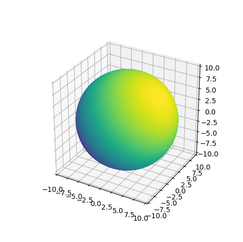

.. _demo3D:

**************************************
3D Surface
**************************************

This is a comparison to the 'very basic plot of a 3D surface' given in the Matplotlib 
`3D surface (solid color) <https://matplotlib.org/3.1.1/gallery/mplot3d/surface3d_2.html#sphx-glr-gallery-mplot3d-surface3d-2-py>`_
example.

.. image:: images/demo3D.png
   :class: sphx-glr-single-img

.. literalinclude:: source/ex_demo3D.py
   :language: python
   :emphasize-lines: 10

Comparing the script that produces this surface plot to the script that produces the surface plot 
using Matplotlib:

* Although the S3Dlib surface uses approximately half the number of faces than the
  basic Matplotlib surface, the appearance is smoother using S3Dlib.  The reason is that
  the S3Dlib surface has nearly identical triangular face sizes and shapes.

* The shade() method for a S3Dlib surface is applied separately, whereas the Matplotlib *plot_surface()*
  method defaults to shading.

* The transform() method to scale S3Dlib surface is applied separately since surface objects
  are initially defined in normalized coordinates. The Matplotlib approach
  embeds this scaling into the surface 'shape' with the array vertex coordinates.

* When adding surfaces to the axis using S3Dlib, the axis limits must be set.  When using the 
  Matplotlib *plot_surface()*, 
  by default the axis and the surface dimensions are inter-related, thus scaling is automatic.

Whereas the last three items in the above list are advantageous for 2D plots using Matplotlib directly,
they tend to be a hindrance for more complex 3D surface visualizations.

Alternative surface shading can be applied using the default colormap by uncommenting the highlighted line,
which produces:

