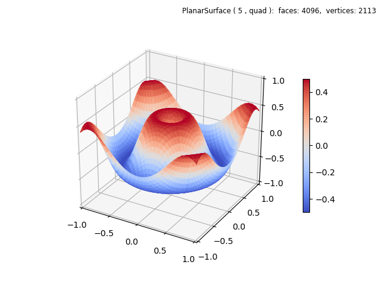
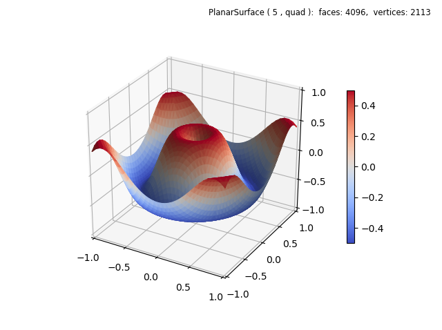

.. _wave:

*******************
Shading
*******************

In this example, the initial plot only emphasizes the surface geometry.
The surface geometry function is defined to produce a geometry similarly to the Matplotlib 
`3D surface <https://matplotlib.org/3.1.1/gallery/mplot3d/surface3d.html#sphx-glr-gallery-mplot3d-surface3d-py>`_
example.  Note that the coordinates
are normalized, requiring scaling in the function definition.

.. image:: images/wave.png
   :class: sphx-glr-single-img

.. literalinclude:: source/ex_wave.py
   :language: python
   :emphasize-lines: 24

The *facecolor* is assigned in the surface constructor and then shading is
applied having a default *depth* of zero.   However, the *cmap* argument is also assigned 
a custom value in the constructor so that the
colorbar displays an appropriate color map.  Otherwise a default colormap would be shown
in the colorbar.

The referenced Matplotlib example uses a cmap applied to the vertical location of the surface.  This can also
be easily applied by uncommenting the highlighted line, which applies a surface cmap.  A simple lambda function
was used instead of defining a separate functional operation  since the surface geometry is already applied.
The resulting plot is shown below.  

Comparing the resolutions, the Matplotlib example uses a square grid of 1600 rectangles
whereas the current example uses 2048 rectangles divided into two triangles each for a total of
4096 faces.

Shading may be further applied to any surface, either a solid color or one with a color map.  By simply
chaining the shade method as::

    wave.map_cmap_from_op( lambda xyz : xyz[2] , 'coolwarm').shade(0.25)

the above z-mapped surface was shaded as follows

