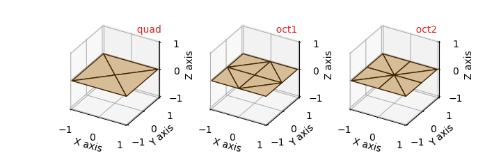
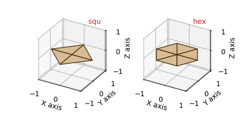
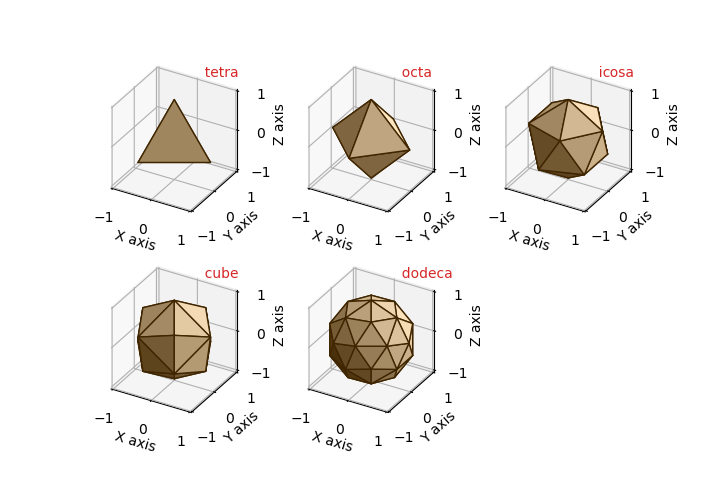
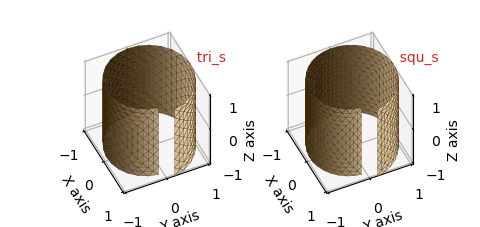
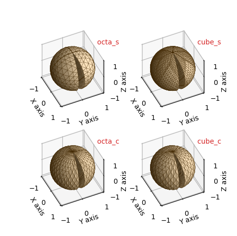
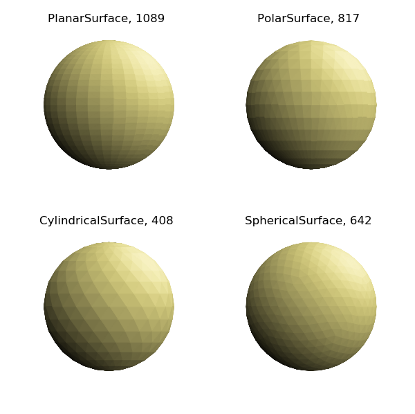
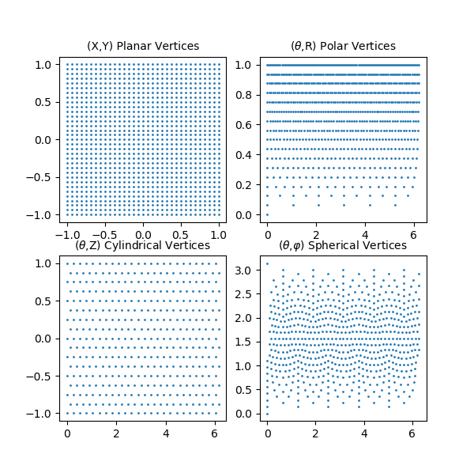
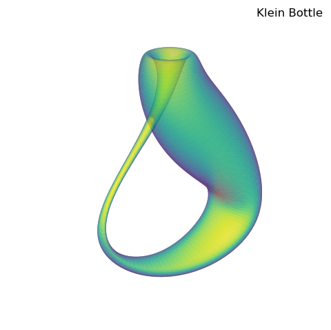

.. _base_surfaces:

.. role::  raw-html(raw)
    :format: html

***************
Base Surfaces
***************

The grid structure for the four surface classes are developed from sets of base surface
geometries.  These base surfaces are composed of a grid of connected triangles.
All grid surfaces are normalized and centered in a cube in the domain of -1 to 1.
The constructors of a xxxxxSurface class have two arguments controlling
the grid; *rez* and *basetype*.  ( xxxxxSurface represents either PlanarSurface, 
PolarSurface, CylindricalSurface, or SphericalSurface class names).  A *surface*
object is constructed as::

    surface = xxxxxSurface(rez,basetype)

The surfaces are generated by recursively subdividing the base surfaces triangles into
four smaller triangles controlled by the *rez* argument.  
As a result, the number of triangular surfaces for a surface object is :raw-html:`4rez`
times the number of faces of the basetype.  This argument is an
integer ranging from 0, no subdivisions, to 7 with a default value of 0.  The *basetype*
argument is a string, the label for one of the class's basetypes.  The basetypes
and corresponding default values
for each class are described in the following sections of this tutorial.

The number of faces, edges and vertices for a xxxxxSurface can be determined from
the class method::

    values = xxxxxSurface.fev(rez,basetype)

which returns a 3D array of integers corresponding to these *values* for
a xxxxxSurface of *rez* and *basetype*.  If no arguments are given, defaults are used.
In addition, the *surface* object string representation, *str(surface)*, contains the
class name, rez, basetype, number of faces and number of vertices.

General Geometries
=========================================================================================

Each surface class has several basetypes which can be used to construct the surface object.
In this section, all surface objects were generated with a default *rez* of 0 using::

    surface = xxxxxSurface(basetype)

For any surface class, any basetype will produce similar geometries. 
However, a specific type may have axial or planar symetries which may be applicable
to a specific function used for mapping.
These symetries can also be adjusted using the object *transform* method before functional mapping.
Selecting a specific basetype can also be particulary beneficial when several overlapping surfaces
are combined to form a final surface geometry, or when surface clipping is applied.

Planar Surface
-----------------------------------------------------------------------------------------

The default basetype for PlanarSurfaces is *quad*.  Both the *oct1* and *oct2* will have 
vertices along the x and y axis. At the origin, *oct2* has eight neighboring faces, whereas *oct1* has four.
The *quad* will have vertices along :raw-html:`|x|=|y|`, but have faces that will cross the axis.
With increasing values of *rez*, planar surfaces are subdivided into smaller triangles and maintain
the square plate shape.

========================================   ========================================  =======================================   ==================================
========================================   ========================================  =======================================   ==================================
coordinate system                          :ref:`planar_coor_tut` 
default basetype                           **quad**
vertex domain                              :raw-html:`-1 &le; x &le; 1`              :raw-html:`-1 &le; y &le; 1`              :raw-html:`z &equals; 0`
========================================   ========================================  =======================================   ==================================

============= ============= ============= ============= 
basetype      faces         edges         vertices
============= ============= ============= ============= 
quad          4             8             5
oct1          8             16            9
oct2          8             16            9         
============= ============= ============= ============= 

Polar Surface
-----------------------------------------------------------------------------------------

The default basetype for PolarSurfaces is *hex*.  The two basetypes of *squ* and *hex* have 4 and 6 fold symetry about the z-axis, respectively.
With increasing *rez*, triangles are subdivided to expand the grid to approximate a circular disk of unit radius.  

========================================   ========================================  =======================================   ==================================
========================================   ========================================  =======================================   ==================================
coordinate system                          :ref:`polar_coor_tut` 
default basetype                           **hex**
vertex domain                              :raw-html:`0 &le; r &le; 1`               :raw-html:`0 &le; &theta; &lt; 2&pi;`     :raw-html:`z &equals; 0`
========================================   ========================================  =======================================   ==================================

============= ============= ============= ============= 
basetype      faces         edges         vertices
============= ============= ============= ============= 
squ           4             8             5
hex           6             12            7
============= ============= ============= ============= 

Cylindrical Surface
-----------------------------------------------------------------------------------------

The default basetype for CylindricalSurfaces is *tri*.  These base surfaces have 3 and 4 fold symetry about the z-axis.
Although the *tri2* and *squ2* basetypes have elongated triangular faces in the vertical direction, this basetype has vertices at the x and y axis
without faces crossing these axis.
With increasing *rez*, triangles are subdivided to expand the grid to approximate a circular cylinder of unit radius and length 2. 

========================================   ========================================  =======================================   ==================================
========================================   ========================================  =======================================   ==================================
coordinate system                          :ref:`cylindrical_coor_tut` 
default basetype                           **tri**
vertex domain                              :raw-html:`r &equals; 1`                  :raw-html:`0 &le; &theta; &lt; 2&pi;`     :raw-html:`-1 &le; z &le; 1`
========================================   ========================================  =======================================   ==================================

.. image:: images/base_cylindrical.png
   :class: sphx-glr-single-img

============= ============= ============= ============= 
basetype      faces         edges         vertices
============= ============= ============= ============= 
tri           12            21            9
squ           16            28            12
tri2          12            21            9         
squ2          16            28            12
============= ============= ============= ============= 

Spherical Surface
-----------------------------------------------------------------------------------------

The default basetype for SphericalSurfaces is *icosa*. All basetypes are based on the five Platonic solids. 
The *cube* basetype is a cube with the cubic faces subdivided into 4 triangles.  The 
*dodeca* basetype is a dodecahedron with the pentagon faces subdivided into 5 triangles.
With increasing *rez*, triangles are subdivided to expand the grid to approximate a sphere of unit radius.  

========================================   ========================================  =======================================   ==================================
========================================   ========================================  =======================================   ==================================
coordinate system                          :ref:`spherical_coor_tut` 
default basetype                           **icosa**
vertex domain                              :raw-html:`r &equals; 1`                  :raw-html:`0 &le; &theta; &lt; 2&pi;`     :raw-html:`0 &le; &phi; &le; &pi;`
========================================   ========================================  =======================================   ==================================

============= ============= ============= ============= 
basetype      faces         edges         vertices
============= ============= ============= ============= 
tetra         4             6             4
octa          8             12            6
icosa         20            30            12         
cube          24            36            14
dodeca        60            90            32
============= ============= ============= ============= 

Split Geometries
=========================================================================================

For the general surfaces with radial coordinates, the coordinates are cyclic with
:raw-html:`&theta;` = 0 and :raw-html:`&theta; = 2&pi;` being the same coordinate vertex position.
For polar and spherical surfaces, there is no unique coordinate mapping for :raw-html:`(r,&theta;)` at
the origin, i.e. :raw-html:`(0,&theta;)` is the same point, regardless of :raw-html:`&theta;`.

The 'split' geometries described in this section provide grids which overcome these restrictions.
These geometries are defined so that two distinct vertices are located
at :raw-html:`&theta;` equal to 0 and :raw-html:`2&pi;`.
The triangular faces at these vertices are not connected, hence the name 'split geometries'.

For the polar and spherical basetypes, there are two types of basetype split geometries.
Based on the general surface basetype names, the basetypes are labeled using a suffix, *_s* and *_c*
to identify the two types:

    * **_s** - Multiple vertices, not a single point, 'near' the origin are used to construct the base surface.

     These basetypes are useful when mapping is dependent on :raw-html:`&theta;` at the origin.
      

    * **_c** - The minimum annular position of vertices can be specified in the constructor with the  *minrad* argument.

     These basetypes are particularly useful when mapping functions have a singularity at the origin.  
     This restricts function evaluation of coordinates at minimum distance from the origin.

The *minrad* is a named parameter in the surface object constructor as::

    surface = xxxxxSurface(rez,basetype,minrad=mr) 

The *minrad* argument default is 0.01 and should be reasonably set no larger than 0.75. 

.. note::
   Since these base surfaces are not cyclic in :raw-html:`&theta;`, functional mapping of the geometry is not restricted
   to extending the upper bound of :raw-html:`&theta;` beyond :raw-html:`2&pi;`.   This type of mapping has been used
   in numerous :ref:`functional-maps` examples. 

In the following figures for these surfaces, slight mapping of the surface was used to accentuate the split in the surface geometry.
A *rez* = 3 was used to further enhance the geometries for these surfaces. 

These split geometries are very useful when describing non-orientable surfaces.  Numerous examples
are shown for such surfaces, including a  :raw-html:`M&ouml;bius` strip and a Klein bottle.
( See :ref:`twistribbon` and :ref:`klein_bottle` )

Polar Surface
-----------------------------------------------------------------------------------------

Usage of these basetypes are demonstrated in the examples :ref:`screw` (hex_s) and :ref:`bour` (hex_c)

========================================   ========================================  =======================================   =========================================
========================================   ========================================  =======================================   =========================================
coordinate system                          :ref:`polar_coor_tut` 
squ_s, hex_s                               :raw-html:`0 &lsim; r &le; 1`             :raw-html:`0 &le; &theta; &le; 2&pi;`     :raw-html:`z &equals; 0`
squ_c, hex_c                               :raw-html:`minrad &le; r &le; 1`          :raw-html:`0 &le; &theta; &le; 2&pi;`     :raw-html:`z &equals; 0`
========================================   ========================================  =======================================   =========================================

.. image:: images/base_polar_s.png
   :class: sphx-glr-single-img

============= ============= ============= ============= 
basetype      faces         edges         vertices
============= ============= ============= ============= 
squ_s         7             15            9
hex_s         11            23            13
squ_c         16            29            14         
hex_c         12            22            11
============= ============= ============= ============= 

Cylindrical Surface
-----------------------------------------------------------------------------------------

Usage of these basetypes are demonstrated in the examples :ref:`order_operation` (tri_s) and :ref:`orange_peel` (squ_s)

========================================   ========================================  =======================================   =========================================
========================================   ========================================  =======================================   =========================================
coordinate system                          :ref:`cylindrical_coor_tut` 
tri_s, squ_s                               :raw-html:`r &equals; 1`                  :raw-html:`0 &le; &theta; &le; 2&pi;`     :raw-html:`-1 &le; z &le; 1`
========================================   ========================================  =======================================   =========================================

============= ============= ============= ============= 
basetype      faces         edges         vertices
============= ============= ============= ============= 
tri_s         12            22            11
squ_s         16            29            14
============= ============= ============= ============= 

Spherical Surface
-----------------------------------------------------------------------------------------

Usage of these basetypes are demonstrated in the examples :ref:`roman` (octa_c) and :ref:`klein_bottle` (octa_s)

========================================   ========================================  =======================================   =========================================
========================================   ========================================  =======================================   =========================================
coordinate system                          :ref:`spherical_coor_tut` 
octa_s, cube_s                             :raw-html:`r &equals; 1`                  :raw-html:`0 &le; &theta; &le; 2&pi;`     :raw-html:`0 &lsim; &phi; &lsim; &pi;`
octa_c, cube_c                             :raw-html:`r &equals; 1`                  :raw-html:`0 &le; &theta; &le; 2&pi;`     :raw-html:`&phi;min &le; &phi; &le; &phi;max`
========================================   ========================================  =======================================   =========================================

The *minrad* argument offsets the range of :raw-html:`&phi; by &pm;sin-1(<small>minrad</small>)` for the *octa_c* and *cube_c* basetypes.

============= ============= ============= ============= 
basetype      faces         edges         vertices
============= ============= ============= ============= 
octa_s        14            26            13
cube_s        48            80            33
octa_c        16            29            14         
cube_c        12            22            11
============= ============= ============= ============= 

.. _base_selection:

Selecting a Base
=========================================================================================

With the variety of native coordinates and surfaces, selecting the optimal base surface
may not be obvious.  Intuitively, if the surface 'looks' like a squashed sphere,
a SphericalSurface object would probably be the best choice.  However, for complex functional
relationships, optimal selection will depend on:

#. The native coordinate system

    * functional description

    * functional domain

    * surface symetry

    * degree of local surface curvature

#. Optimal uniformity in

    * triangular face areas and shapes

    * vertex distribution

The surface subclass bases have been formulated so that the surface faces are of uniform shape and
size.  As a result, using a subclass object that transforms to preserve the overall 'shape'
is often the best starting object.  For example, a surface with axial symetry about the z-axis
is best represented using a surface object with and axial coordinate, rather than a PlanarSurface object.
Also, the functional
description is easier to apply and to interpret if it is described in the native coordinates.

Instead of interpreting the subclass objects as surface geometries, it can be advantageous to consider
the objects in terms of a graph of interconnected vertices and edges.  The set of vertices are defined
within the domain of two dependent variables points.  For the subclass objects:

=======================    ================================
Graph (Class)              Dependent Variable            
=======================    ================================
PlanarSurface              ( x,y )                        
PolarSurface               ( r, :raw-html:`&theta;` )     
CylindricalSurface         ( :raw-html:`&theta;`, z ) 
SphericalSurface           ( :raw-html:`&theta; , &phi;` )  
=======================    ================================

With appropriate mapping, each of these 'graphs' can be transformed into a similar surface.
Consider the simple example of a sphere.  A usual method of developing a grid to construct the surface is to
uniformly subdivide the angular and azimuthal coordinates.  Alternatively using S3Dlib, the four different 'graphs' can
be used to visualize the sphere, as shown below. The number in each plot title represents the number of vertices.

Using a SphericalSurface object, vertices are distributed so that
the triangular faces are relatively uniform by design, without a concentration of elongated faces near the poles.
For the other three objects, faces are not uniform and face anomalies may also occur at the poles since multiple vertices
are formed at these two locations. 

The vertex distribution of these four surfaces is

For complex functional mapping involving parametric equations, a uniform vertex distribution may be
preferable.  The above two figures were constructed from the script:

.. literalinclude:: source/gu_sphere_plane.py
   :language: python
   :emphasize-lines: 37,41,45

Notice in the above functions *plane2sphere* and cylinder2sphere*, the T variable is set negative.  This is
to have a consistent outward normal to the faces using a right-hand rule definition.

.. _planarKlein:

Planar Klein Bottle
-----------------------------------------------------------------------------------------

A major advantage of using S3Dlib is that surface geometries are set in one expression.
Therefore, during code development, effects of geometry can be easily evaluated and alternatives
can be made.  In addition,
each subclass has the *coor_convert* method to transform among planar, polar, cylindrical
and spherical coordinates.

This provides flexibility to evaluate the visualization for different grids.  For example,
the :ref:`klein_bottle` example uses a SphericalSurface object.  It can just as easily
be constructed uing a PlanarSurface object with the function slightly modified as:

.. literalinclude:: source/gu_klein_planar.py
   :language: python
   :lines: 10-28
   :emphasize-lines: 3-4

Where now, the surface is simply defined as:

.. literalinclude:: source/gu_klein_planar.py
   :language: python
   :lines: 35,36

Resulting in a similar visualization as:

This visualization is 'smoother' than the example due to the uniform distribution of vertices in the parametric
dependent variables.  This use of the planar and cylindrical base and split surfaces is often useful for parametric functions
for this reason, even though the functions may be expressed in other native coordinates.

