.. _color_maps:

***********************
Color Map Utilities 
***********************

Matplotlib provides numerous built-in colormaps and an excellent tutorial on
`Choosing Colormaps <https://matplotlib.org/3.1.0/tutorials/colors/colormaps.html>`_.
Familiarity with these built-in color maps is suggested.
The *sequential* built-in maps are particularly useful for 3D surface visualizations.

Choosing colormaps for surfaces in 3D has the additional requirement of 
enhancing the geometric visualization along with defining functional values. 
S3Dlib provides mulitple easy-to-use methods for 
creating custom colormaps which are particularly applicable for displaying 3D surfaces.
These methods are particularly useful when transparent and mirrored colormaps are needed
for clear visualizations of 3D surfaces, or simply for a more graphic display.
All colormaps returned using these functions are derived from
`matplotlib.colors.Colormap <https://matplotlib.org/3.1.3/api/_as_gen/matplotlib.colors.Colormap.html>`_.  
These functions are available in the module::

    import S3Dlib.cmap_utilities as cmu

In the following discusssion, example colormaps are provided to illustrate the 
usage of the S3Dlib methods.
The colormap graphs were generated using the
script provided in the *Mathplotlib Choosing Colormaps* tutorial, with modifications to display
the example colormaps.

RGB Linear Gradient
=========================================================================================

Simple color maps, linear in RGB space, are created using the function

.. code-block:: python
   
   rgb_cmap_gradient(lowColor,highColor,name,mirrored)

which returns an instance of a registered matplotlib.colors.Colormap with name if provided. 
The color arguments are in 
`Matplotlib Colors <https://matplotlib.org/3.1.0/tutorials/colors/colors.html>`_ format.
The colormap monotonically increases from the *lowColor* to the *highColor* in RGB color space. 
The *mirrored* argument is a boolean and if set *True*, the color map is mirrored with
the *highcolor* at the center.  **Mirrored colormaps are particularly useful for non-orientable
surfaces.**

Several examples using this function are:

.. literalinclude:: source/gu_colormaps.py
   :language: python
   :lines: 19-35

Note that the colormap named 'rgbDefault' is the default colormap if no arguments are provided.

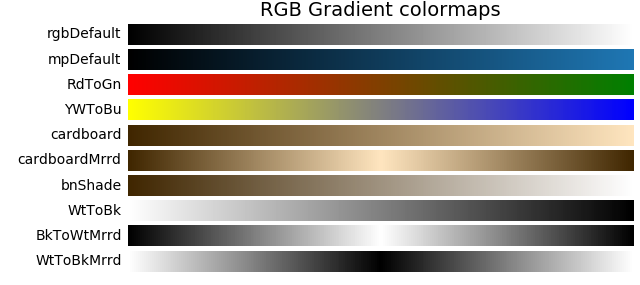

HSV Linear Gradient
=========================================================================================

Simple color maps, linear in HSV space, are created using the function

.. code-block:: python
   
   hsv_cmap_gradient(lowColorArg,highColorArg,name,mirrored)

which returns an instance of a registered matplotlib.colors.Colormap with name, if provided.
The *lowColorArg* and *highColorArg* are HSV or HSVA (hue, saturation, value, alpha) arrays of float values.  
The float values for SVA range in [0,1].

**The float values for hue range in [0,2]**, which is **not** the standard range for hue.  This
was defined in this manner to allow for direction in the cyclic definition of hue.  This hue
mapping from 0 to 2 is shown below.

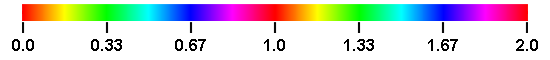

For example, consider a color map going from green (low) to blue (high).  Specifying green
and blue as 0.33 and 0.67, the map will pass through cyan.  However, specifying green
as 1.33, the map will pass through yellow, red and magenta.
The colormap still monotonically increases from the lowColor to the highColor in HSV space.  
The *mirrored* argument is applied in the same manner as previously described for
the RGB gradient color maps.

Hue
-------------------------------------------------

The following are examples of varying the cyclic hue value of the color arguments in both
the forward and backward directions.  In these examples, the saturation and value for
the low and high color arguments were held constant at 1.

.. literalinclude:: source/gu_colormaps.py
   :language: python
   :lines: 37-58

Note that the colormap named 'hsvDefault' is the default colormap if no arguments are provided.
This colormap is equivalent to the Matplotlib built-in colormap named 'hsv'.

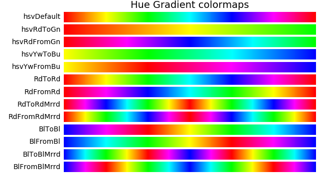

The effect of reversing the order of the low and high color arguments is most notable by comparing
the maps 'RdToRd' versus 'RdFromRd'.  Both start and end with red.
Also, the difference between using RGB and HSV is seen by comparing the yellow to blue 
colormaps in these two color spaces, 'YwToBu'  versus 'hsvYwToBu'.

Saturation and Value
-------------------------------------------------

In these examples, the hue was constant at 0 (red).  The first four colormaps vary value [0,1]
while holding saturation to 1.
The second set vary saturation [0,1] and hold value constant at 1. 

.. literalinclude:: source/gu_colormaps.py
   :language: python
   :lines: 60-72

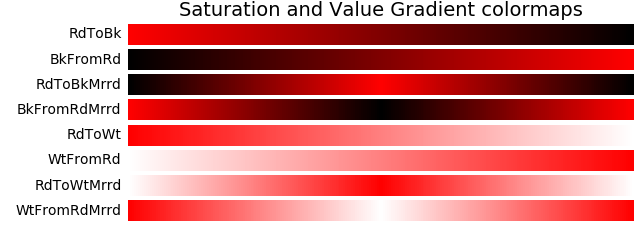

Cyclic and Named Colors
-------------------------------------------------

Since the hue is cyclic, any same hue can be represented by a number plus an integer value.  For example,
blue hue is 0.67, 1.67, 2.66, 3.67, etc.  This results in the ability to produce repeated color maps
by representing the low and high arguments with values greater than 2.

Also, the arguments can be strings of named Matplotlib colors. See for example 
`named colors <https://matplotlib.org/3.1.0/gallery/color/named_colors.html>`_.
To shift the named color hues above 1,
the color string is prefixed with a '+' character.
This provides the method of reversing the direction of the hue while still using named color values.

Examples using cyclic and named color for HSV color maps are:

.. literalinclude:: source/gu_colormaps.py
   :language: python
   :lines: 95-108

This produces the following colormaps.

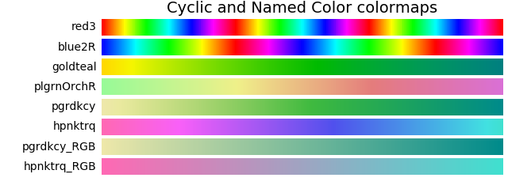

In the above, the last two colormaps use the RGB gradient method as
a comparison to the map produced by the HSV gradient method which precedes them.
This exemplifies the effect of a reduction in saturation and value while linearly
moving through RGB space.

Hue HSV Modifications 
=========================================================================================

While varying hue in HSV color space, there is an apparent 'sharpness' or rapid change in
apparent color at yellow, cyan, and magenta.  This is seen in 'hsv' colormap shown below.

This perceptual change is also reflected in the rapid change in CIELAB color space
represented by lightness, L*.  (A more detailed discussion of this is in
`Choosing Colors in Matplotlib <https://matplotlib.org/3.1.1/tutorials/colors/colormaps.html>`_ ).

To smooth-out this sharpness in the HSV colormap, the following method is available::

    hue_cmap(smooth, lowHue, highHue, name)

Which returns a colormap of constant value and saturation of 1. The 
*smooth* parameter is the degree of smoothing at yellow, cyan and magenta, with a value of
1 for no smoothing.  For values greater than one, hues around yellow, cyan and magenta are
expanded, reducing the extent of red, green and blue hues.  For values less than one,
the opposite occurs.  The *smooth* value range is [0.1,10]. The default value is 1.6.
The parameters *lowHue* and *highHue* are
similary defined for the hue as given in the previous sections.  When color names
are used for this parameter, only the hue value of the color is used.

Example colormaps using this method are given below.

.. literalinclude:: source/gu_colormaps.py
   :language: python
   :lines: 111-122

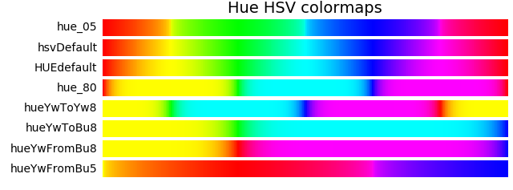

The effect of lightness, L*, on smoothing is shown in the grayscale maps below, for the first four
colormaps.

A qualitative description of smoothing by examining the L* numerical values is shown in the 
plot below.
The effect of smoothing is dramatically illustrated in this plot showing the peaks, valleys and
plateaus of the lightness curves at CMY (0.167, 0.5, 0.833) and  RGB (0.0, 0.33, 0.67).

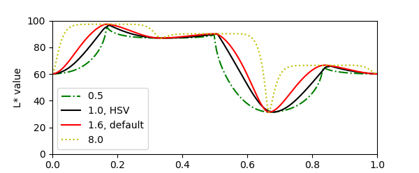

The script for producing the above plot is given below.

.. literalinclude:: source/gu_cmap_plot.py
   :language: python

The effect of smoothing out an HSV colormap when applied to a surface is shown in the
simple surface plot below.

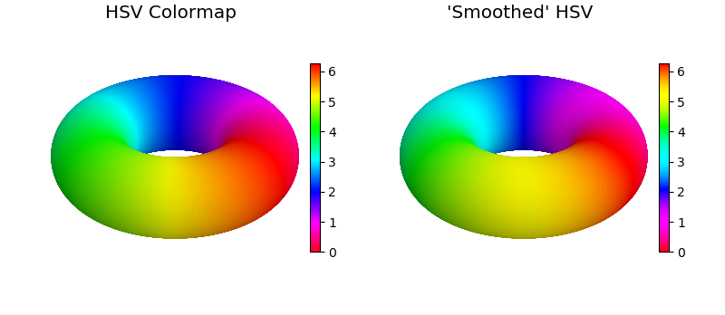

Smooth HSV
=========================================================================================

The 'smooth' parameter is also available when using the *hsv_cmap_gradient* method.  This effect
is most apparent when creating colormaps between the RGB colors.  The regular and smooth
colormaps are shown as a comparison.

.. literalinclude:: source/gu_colormaps.py
   :language: python
   :lines: 125-134

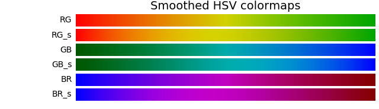

In these examples, the red and green values were selected with reduced values to create
maps with similar starting and ending L* values, as seen in the following plot.

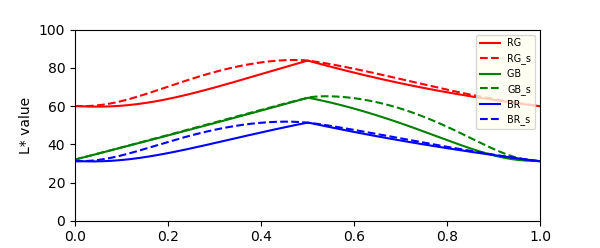

Lab Linear Gradient
=========================================================================================

A colormap with a linearly monotonic increasing L* values may be preferable for increased 
perception when used for illustrating surface geometries.  This type of map is also
beneficial when surface geometry visualization is needed when printed on black and
white printers.  The cmap_xtra file provides the *Lab_cmap_gradient* method to produce colormaps
which are linear in Lab space. Consequently, these maps will be linear in L*.
Linear Lab colormaps are created using a function from a file and creating the cmap as::

   from cmap_xtra import Lab_cmap_gradient
   cmap = Lab_cmap_gradient(lowColor, highColor, name, mirrored)

All calling parameters are identical to those used in the *rgb_cmap_gradient* method.

.. note::
   This function requires the installation
   of the  *colorspacious* package.  All methods referred to in this guide use the
   *cmap_utilities* module except this one.

Example generation of colormaps using *Lab_cmap_gradient* are given below.

.. literalinclude:: source/gu_colormaps.py
   :language: python
   :lines: 137-144

The resulting colormaps are below.  The linear Matplotlib colormaps of 'magma' and 'viridis' are shown
as a comparison to those generated using this function.

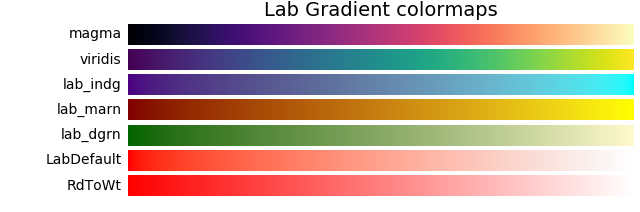

Grayscale maps for these colormaps illustrate the perceived lightness values.

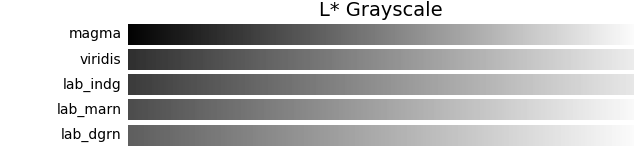

The plot below quantitatively demonstrates the linear nature of the colormaps and the
relative differences between the maps.

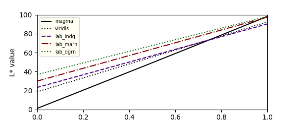

The application of a linear Lab colormap to visualize surface geometry is shown below.  The
addition of shading will enhance the effect, effectively reducing the L*  at the lower
end of the scale.

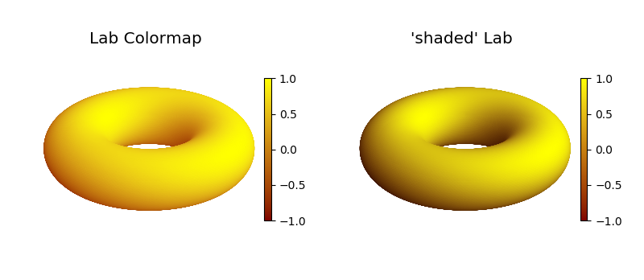

Stitch Cmaps
=========================================================================================

Colormaps may be created from concatenated colormaps using

.. code-block:: python
   
   stitch_cmap( *maps, bndry, name)

which returns an instance of a registered matplotlib.colors.Colormap with name, if provided.  
The *bndry* argument is a float or a list of float values designating the boundaries between the
input maps.  Values range from greater than 0 to less than 1.  If *bndry* is None (default), the
input maps are evenly spaced.

.. literalinclude:: source/gu_colormaps.py
   :language: python
   :lines: 148-178

This method can be used to construct simple linear tricolor or multi-color colormaps, for example *fWt_2*.
Specific colormap values can be emphasized using this method as seen in the *inferno_3* and *RdCy_4* examples,
(0.2, 0.6) and (0.3,0.8) respectively.  Using Lab colormaps, 
`Diverging and  Cyclic <https://matplotlib.org/3.1.1/tutorials/colors/colormaps.html#diverging>`_ 
colormaps can be constructed.  

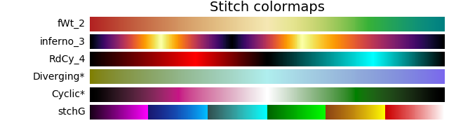

RGB Binary
=========================================================================================

Simple two color maps are created using the function

.. code-block:: python
   
   binary_cmap(negColor,posColor,name)

which returns an instance of a registered matplotlib.colors.Colormap with name, if provided.  
The colormap maps 0 to 0.5 as the negColor and 0.5 1.0 as the posColor.  Both color arguments
are standard RGBA color formats.

.. literalinclude:: source/gu_colormaps.py
   :language: python
   :lines: 11-17

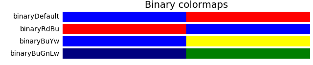

Mirrored and Reversed
=========================================================================================

Any registered colormap can have the order reversed using

.. code-block:: python
   
   reversed_cmap(cmap)

which returns a new instance of a registered colormap.  The returned colormap name is 
the *cmap* name with the suffix '_rev'.

Any registered colormap can be used to create a mirrored color map using

.. code-block:: python
   
   mirrored_cmap(cmap,rev)

The returned colormap name is 
the *cmap* name with the suffix '_m'.  If the *rev* argument is True,
the returned colormap is also reversed and the name has the suffix '_mr'.

.. literalinclude:: source/gu_colormaps.py
   :language: python
   :lines: 74-93

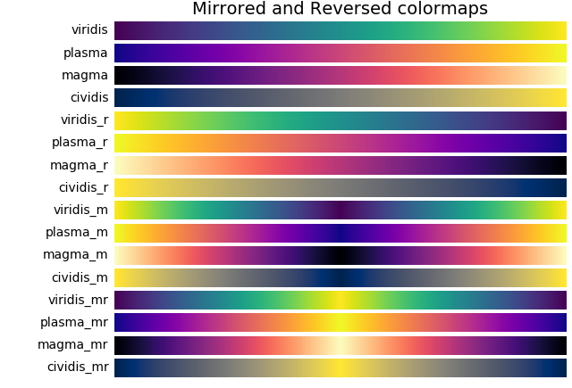

Transparency
=========================================================================================

Any registered colormap can have the transparency set using

.. code-block:: python
   
   alpha_cmap(cmap,alpha)

where *cmap* argument is a cmap or a registered colormap name. The argument *alpha* ranges from 0 to 1 for
fully transparent to opaque, respectively.  This function will create and return a cmap with a
name with suffix '_a'.  All colors in the map will have the same alpha value.  

Tandem Cmaps
=========================================================================================

The gradient and binary cmap functions return a colormap.  With these created cmaps, the
mirrored, reveresed and transparency cmap functions may be used in sequence to create additional
complex cmaps.  This method was useful for creating the visualization of :ref:`klein_bottle`.
In that case, the matplotlib built-in cmap *viridis* was mirrored and then made transparent.

Miscellaneous
=========================================================================================

Colormap Plot Script
-------------------------------------------------

The development of custom colormaps should consider the visual, perceptual and applicability
to black and white printing.   Any created colormaps can be readily analysed and compared
to standard colormaps using the following code.  Three figures are generated; L* plot,
color maps, and grayscale maps.  Colormaps to evaluate are set in the highlighted line
defined by *cmap*, an array of colormaps or registered colormap names.

.. note::
    The script includes reference to the **cspace_converter** object which is located
    in the `colorspacious  <https://pypi.org/project/colorspacious/>`_ package.

.. literalinclude:: source/gu_Lstar_PLOT.py
   :language: python
   :emphasize-lines: 10

Named Colors
-------------------------------------------------

There are numerous available colors in the
`List of named colors <https://matplotlib.org/3.1.0/gallery/color/named_colors.html>`_ 
in Matplotlib, sorted by hsv color value. When constructing custom colormaps, comparing colors
based on the Lab color values is often convenient.  The following table lists the named
CSS colors sorted by Lab color.

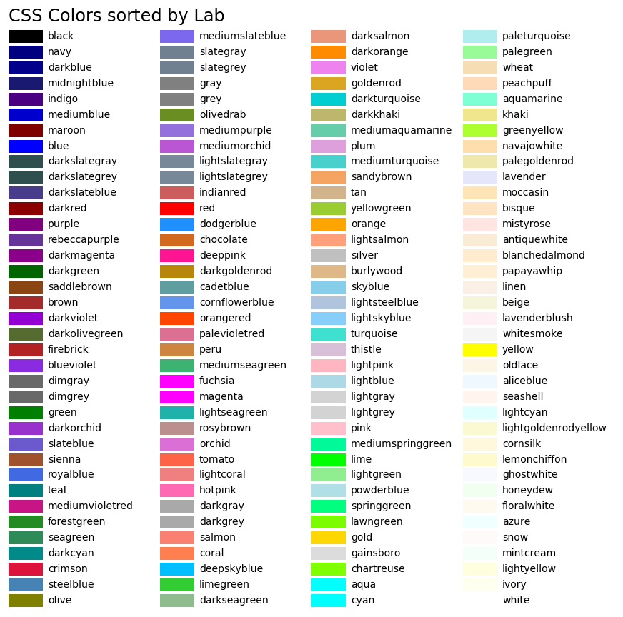

