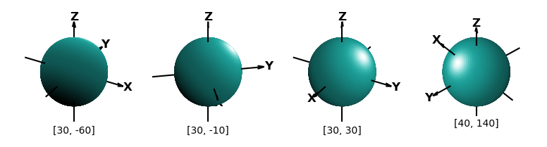
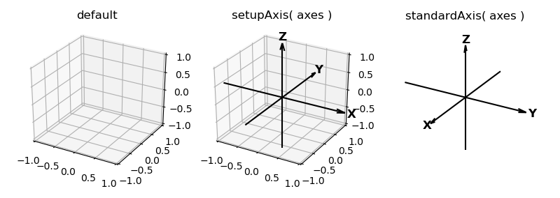
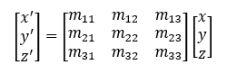
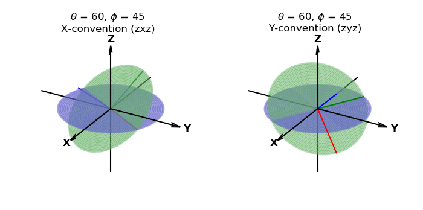
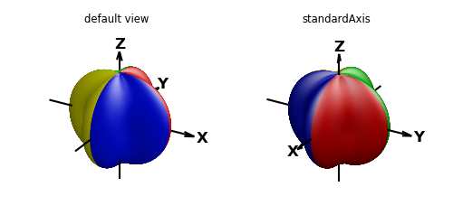
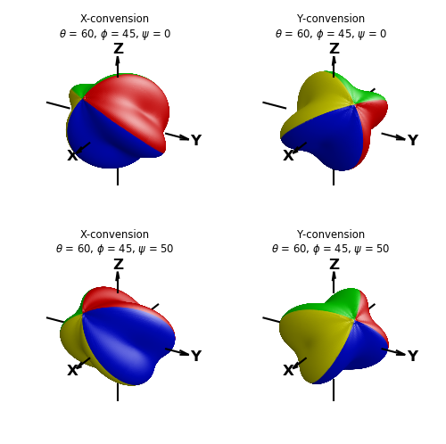
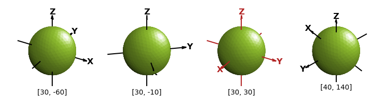

.. _orientation:

.. role::  raw-html(raw)
    :format: html

****************************************
Orientation 
****************************************

Figure orientation in 2D is generally of little concern. Usually, plots are oriented with independent variables 
on the horizontal axis, x-axis, and dependent ones on the vertical axis, y-axis.  Then viewed normal to plane.

For 3D surfaces, visualizations are controlled by

* viewing position relative to the coordinate axes
* surface orientation relative to the coordinate axes
* lighting direction relative to the viewer or coordinate axes

Coordinate Views
=======================================================================

Standard 3D axis views are controlled by the Matplotlib 3D *axes* method::

    axes.view_init(elev, azim)

where *elev* and *azim* are the elevation and azimuthal viewing angle relative to the coordinate axis.
The *azim* controls the rotation about the z-axis. The *elev* sets the z-axis tilt foward and back from
the view.  

Since restricted to controlling views using these two arguments, the omission of a third rotation in 3D doesn't permit
the z-axis to be tilted to the right or left in the view.  The transform method discussed in the next
section permits viewing the surface object from this perspective by rotating the surface in 
addition to the view.  The following plots show the effect of shading and highlighting for various 
view orientations, with the illumination direction of [0,1,1].
 

The default values for *elev* and *azim* are 30 and -60, respectively in degree units, which
is used if this method is not called.
In addition, three planes normal to the axis are shown by default.  S3Dlib provides a method
to show an xyz coordinate axis system in the 3D *axes* visualization, called as::

    setupAxis( axes, length=1.5, width=2, color='black', offset=0.0, negaxis=True )

Where all arguments, except the 3D *axes* are named arguments.  The *offset* argument is the position
on the axis where the tail of the coordinate arrow is located.  The *negaxis* argument is set to False
if the negative coordinate lines are not to be shown.

When viewing surfaces, particularly mathematical function representations, a 'standard' coordinate
system is usually shown with the x and y axis pointing to the left and right, with the z-axis pointing upward.
S3Dlib provides a method to initialize the plot for s 'standard' view using the method::

    standardAxis( axes )

This method uses the same argument list as the previous method.  When this method is called, the
axis view is changed using view_init(30,30) and the axis set off.   In addition, the minimum and
maximum x, y, and z-axis are set to -1 and 1, which is consistent with the S3Dlib object size
normalizations.
 
The default axes setup for the three methods is shown in the plots below.

Object Rotations
=======================================================================

Surface objects can be transformed so that the surface rotates relative to the origin using
the transform method::

    surface.transform(matrix)

where the  *matrix* argument is a 3x3 transformation matrix, e.g.

The use of a transformation matrix argument provides flexibility, but for simple surface
rotations, S3Dlib provides a convenient method of calculating a rotational matrix from angles using
the method::

    matrix = eulerRot(theta, phi, psi=0, useXconv=True, inrad=False)

where *theta*, *phi* and *psi* ( :raw-html:`&theta;, &phi;, &psi;` )
are Euler rotational angles about the coordinate axis using the right hand rule.
The angles are in degrees as the default.
Rotations in 3D are dependent on the sequence of rotations. Two conventions
are supported. The sequence of rotations are 

=====   ====================   ====================   ====================
Order   Rotation               X-convention  (zxz)    Y-convention  (zyz) 
=====   ====================   ====================   ====================
1       :raw-html:`&theta;`    Z - axis               Z - axis
2       :raw-html:`&phi;`      X - axis               Y - axis
3       :raw-html:`&psi;`      Z - axis               Z - axis
=====   ====================   ====================   ====================

The default is to use X-convention.  Setting the *useXconv* argument to False changes
the interpretation to Y-convention. When the *inrad* argument is set to True,
the rotational angles will be interpreted in radians.
The rotation of the coordinate axis is shown below, which illustrates the difference between the
X and Y conventions.

To illustrate the final rotation :raw-html:`&psi;` about the z-axis (shown in blue in the above figure),
consider the following surface shown in the default view and standard axis view below:

The following shows the same surface using a standard axis and
various surface rotations. Plots have the same values for :raw-html:`&theta; and &phi;` which was
used in the previous coordinate plot.  The effect of the :raw-html:`&psi;` rotation is seen
by comparing the top to bottom surface orientations.

.. _illum_source:

Illumination Source
=======================================================================

The perception of 3D surfaces from a 2D image is accomplished by 'simulating' an illumination
projection based on surface normals.  S3Dlib illumination sources are referenced relative
to the coordinate axis, as discussed in the :ref:`shading` guide.  
The Matplotlib view parameters of elevation and azimuth are also referenced
relative to the coordinate axis.

As coordinate views and object orientations are changed from the default,
it may be useful to have an illumination source that is referenced to the viewer,
not the coordinate axis.  This is
particularly needed when animations are required to be 'perceived as' the object orientation
being changed, not the viewer orientation changing.  This was achieved in
the :ref:`anim_bases` animation example.  In that case, the objects are perceived as rotating, not
the viewer moving around the objects.  However, the opposite was actually being calculated with
the illumination source position changing with the view.

So, the two types of perceptions of the same object are:

* Stationary viewer - Illumination source referenced to the viewer.

* Stationary object - Illumination source referenced to the coordinate system.

Using a sunset analogy, is the sun going down or are you rotating backward?  It's the same image.
Kepler, Copernicus and Galileo made a perceptual leap.

The illumination source relative to the viewer can be determined using the function::

    reldir = rtv(direction,elev,azim)

where direction is a 3D vector in xyz coordinates. The parameters, 'elev' and 'azim'
are the view orientations.  Using the 'reldir' for the direction in the *shade* and
*hilite* methods, the light source will always appear
to come from the same direction, independent of the coordinate elev and azim view. 
In the following figures, a direction argument of [1,1,1] was used for all views.

A good example of using the relative illumination source is shown in the :ref:`anim_pycube` animation example
where both *elev* and *azim* parameters are varied from frame to frame.

