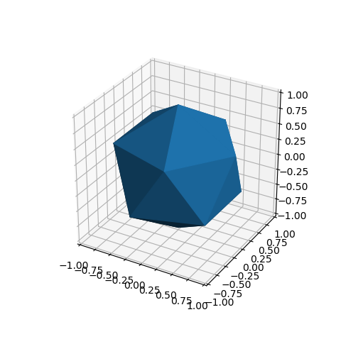
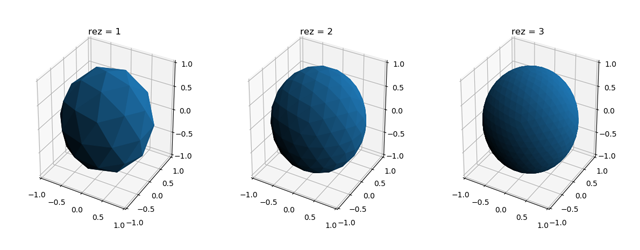
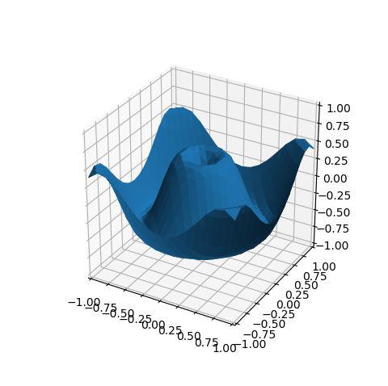
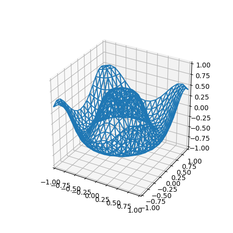
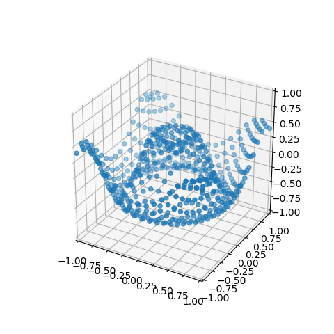
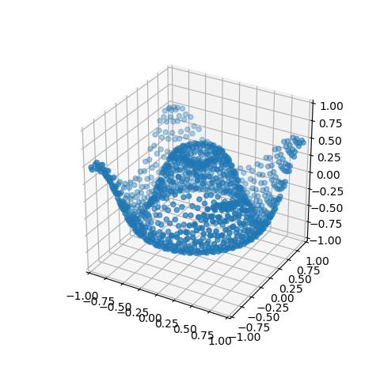
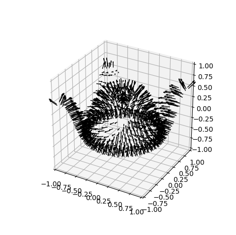

.. _helloworld:

***************
Hello World
***************

This page covers the basics of creating a surface plot, introducing the concepts of

* instantiation of a surface object
* adding the surface object to a 3D axes
* surface resolution
* functional mapping
* mesh and scatter plots

.. _gen-concepts:

General Concepts
=========================================================================================

Throughout this tutorial and all the example plots, the construction and display of
surfaces consist of three basic steps.

1. Define functions for geometric mapping and coloring the surfaces.
2. Instantiate surface objects and apply mapping methods.
3. Setup the Matplotlib figure and axes.

For the first step, all functions controlling geometry and color must accept a coordinate argument
of a 3xN Numpy array.  The coordinates are in the relative 3D coordinate system. The 'relative' system depends
on the surface which is to be mapped.  These surfaces are in either planar, polar, cylindrical
or spherical coordinates.

In the second step, S3Dlib objects are instantiated.  All surfaces are defined in normalized
coordinates with methods that provide the ability to scale and transform the surface.  Surface
coordinates are now set using the functions defined in the first step. Also, any colors
applied to the surface are made now.

The final step is to use the various tools in Matplotlib to construct and annotate the 3D
figure.  At the end of this step, the surface objects are simply added to an axes3D as::

    axes.add_collection3D(surface)

The addition of the surface to the axes may occur at any step after the axes is created.

.. _hello-default:

Default 3D Surface
=========================================================================================

The following is the script for producing a default triangulated spherical surface.

.. literalinclude:: source/hw_helloworld.py
   :language: python
   :linenos:

which produces the following plot:

Here, the line::

    surface.shade()

is needed  to visualize the different faces, otherwise all triangular surfaces would be the
same color and only a polygon of uniform color would be recognized.  The line to set the
axis limits::

    surface.ax.set(xlim=(-1,1), ylim=(-1,1), zlim=(-1,1))

is generally always inserted, over-riding the Matplotlib default axis limits.

.. _hello-0:

Surface Resolution
=========================================================================================

A surface is a collection of triangles that originate by subdividing the base triangles.
Each base triangle is recursively subdivided into four subtriangles.  The number of 
recursions (surface resolution) is controlled by the *rez*, the first argument of the surface
constructor.  The default rez is 0, as was used in the previous example. This can be be
explicitly assigned as:: 

    surface = s3d.SphericalSurface(0)

The following figure shows the progressions
to higher resolutions for the SphericalSurface, from rez=1 to rez=3

In general, rez is set to a low value, e.g. 2 or 3, during script development for
responsive graphic interactivity.
Once setup, rez is increased for the desired resolution.  A rez of 4 through 6 is sufficient
for most surface plots.  However, increases to higher rez may be necessary when applying
images, using surface clipping or having interacting surfaces.  This may also be the case for
specific geometric mapping functions which produce large surface curvatures.

.. _hello-1:

Geometric Mapping
=========================================================================================

As a starting point, consider the 
`3D surface <https://matplotlib.org/gallery/mplot3d/surface3d.html#sphx-glr-gallery-mplot3d-surface3d-py>`_
example from the Matplotlib gallery.  When using
S3Dlib, surface coloration and surface geometry are separately applied.  Surface coloration is
discussed in the subsequent tutorial.  For this discussion, the surface color is the default used in
the Matplotlib. 

The Matplotlib example is in Cartesian coordinates, so a PlanarSurface object will be used for
this example instead of the SphericalSurface used in the previous example, line 10.
First, the function labeled *planarfunc* is added to the previous
script.  Then the single highlighted line is added to use this function for mapping the geometry
of the planar surface.

.. note::
   Any function definition must operate on coordinate Numpy arrays and return Numpy arrays.

.. literalinclude:: source/hw_helloworld_2.py
   :language: python
   :emphasize-lines: 16

Using a rez of 4 produces the following plot.

.. _hello-2:

Surface Properties
=========================================================================================

Surfaces have accessible properties

- edges
- vertices
- face centers
- face normals

Edges and face normals are both added to a plot in the similar method used to add the surface
object, by using the axes *add_collection3d* method.
Vertices and face centers are coordinate arrays and are added to the figure
using the standard Matplotlib 3D scatter plot method, *scatter*.

Edges
-----------------------------------------------------------------------------------------

The edges of the triangulated surface are accessible through an *edges* property of type
`Line3DCollection <https://matplotlib.org/3.1.1/api/_as_gen/mpl_toolkits.mplot3d.art3d.Line3DCollection.html>`_.
As a result, this object can be added directly to the axes in a similar manner as the surface
object. Instead of adding the surface to the axes, add the edges as:

.. literalinclude:: source/hw_wireframe.py
   :language: python
   :lines: 24

with the result of a wireframe plot as shown below. 

Since the surface faces are not shown, shading may be omitted.

.. _hello-3:

Vertices
-----------------------------------------------------------------------------------------

The vertices of the triangulated surface are accessible through a surface property of
a 3xN coordinate array.
These vertices are displayed by creating a simple scatter plot as:

.. literalinclude:: source/hw_vertices.py
   :language: python
   :lines: 24-25

to produce the plot as shown below (the surface in now not added to the axes).

Face Centers
-----------------------------------------------------------------------------------------

Like the vertices, face centers are a 3xN coordinate array.  
These face centers are displayed using a scatter plot as:

.. literalinclude:: source/hw_faces.py
   :language: python
   :lines: 24-25

to produce a plot as shown below (the surface in now not added to the axes).

Face Normals
-----------------------------------------------------------------------------------------

Face normals are a Vector3DCollection class which is inherited from the 
Line3DCollection class.
As a result of the inheritance, face normals are added to the plot similar to adding the
surface and edges.  The face normals object is accessible from a surface object method.
Each normal in the collection corresponds to a face.

These normals are displayed by calling the method and directly passing the result
to the axes as:

.. literalinclude:: source/hw_normals.py
   :language: python
   :lines: 24

to produce a plot of vectors as shown below (the surface in not added to the axes).  
The face normal object properties are
controlled using the method arguments which are detailed in the :ref:`vectorfields` guide.
In this example, a scaling factor of 0.2 was used.

Since normals are associated with each face, a lower rez surface is more applicable for
visualizing the face normals.

