# Colormap Studies

This directory contains custom colormaps which were created using using
the [S3Dlib](https://s3dlib.org) cmap_utilities package.
Colormap images and line plots (excluding maps having transparency) were generated
using the script given in the documentation:

Documentation>>Guides>>Color Map Utilities>>Miscellaneous>>Colormap
Plot [Script](https://s3dlib.org/guides/color_maps.html#colormap-plot-script) 

---
---

> ## Colormaps having transparency
>
> The script provided in version 1.0 documentation would produce colormaps
> showing the figure backgound color where the maps contained transparent colors.
> The updated script, ***src/gu_Lstar_PLOT.py*** , provides viewing maps
> which have a non-unity alpha channel overlayed on a checkboard pattern.
>
> 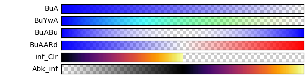
>
> The script for defining the colormap array is:

```python
cmu.hsv_cmap_gradient( [.67,1,1,1], [.67,1,1,0], 'BuA' )
cmu.hsv_cmap_gradient( [.67,1,1,1], [.17,1,1,0], 'BuYwA' )
cmu.hsv_cmap_gradient( [0,1,1,0], [0,1,1,1], 'ARd' )
cmu.hsv_cmap_gradient( [.67,0,1,0], [.67,1,1,1], 'BuABu', mirrored=True )
cmu.stitch_cmap('BuA', 'ARd', name='BuAARd' )
cmu.rgb_cmap_gradient( [0,0,1,0], [0,0,1,0], 'clear' )
cmu.stitch_cmap('inferno', 'clear', name='inf_Clr' )
cmu.rgb_cmap_gradient([0,0,0,0],[0,0,0,1],'ABk' )
cmu.stitch_cmap('ABk', 'inferno', name='Abk_inf' )

cmaps = [ 'BuA', 'BuYwA','BuABu', 'BuAARd' ,'inf_Clr', 'Abk_inf' ]
```
> Grey scale maps:
> 
> 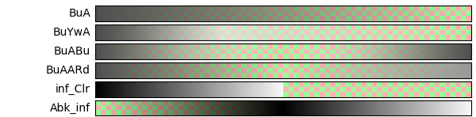
> 
> ### Observations
> 
> - The checkerboard grid easily provides a visual indication of the map transparency. 
> - Maps which are stitched to a *clear* map, such as the 'inf_Clr' example, can
>   be used to clip a surface by hidding the surface using transparent surface color.

---
---

> ## HSV colormaps
>
> 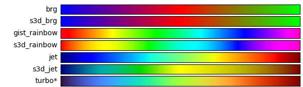
>
> The script for defining the colormap array is:

```python
brgA =cmu.rgb_cmap_gradient('blue','red')
brgB = cmu.rgb_cmap_gradient('red',[0,1,0])
cmu.stitch_cmap(brgA,brgB, name='s3d_brg')

cmu.hue_cmap( 1.6, 'red', 0.9,   name='s3d_rainbow' )

jetA = cmu.hsv_cmap_gradient( [0.667,1,0.5], [0.167,1,1.0],smooth=1.3)
jetB = cmu.hsv_cmap_gradient( [0.167,1,1.0], [0,1,.5], smooth=4)
cmu.stitch_cmap(jetA,jetB, bndry=[0.5], name='s3d_jet')

#turbo_colormap_data = [[0.18995,0.07176,0.23217],....]]
turbo=ListedColormap(turbo_colormap_data)
turbo.name = 'turbo*'

cmaps = [ 'brg','s3d_brg', 'gist_rainbow', 's3d_rainbow', 'jet', 's3d_jet', turbo ]
```
> Grey scale maps:
> 
> 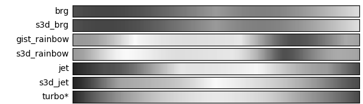
> 
> The Lightness, L*, for the maps is:
> 
> 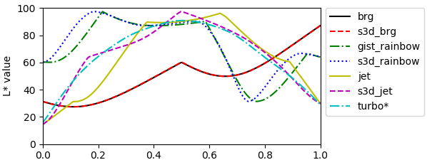
> 
> This study was made to compare Matplotlib brg, gist_rainbow, and jet colormaps to similar
> colormaps which can be created using S3Dlib cmap_utilities.  Of particular interest
> is the uniformity of the color lightness and visual colors in the maps.  
> 
> The 'turbo*' colormap (the list comented out in the above script) is shown and referenced in
> the [Matplotlib tutorial](https://matplotlib.org/tutorials/colors/colormaps.html#turbo).
> A detailed description is at [Google AI Blog](https://ai.googleblog.com/2019/08/turbo-improved-rainbow-colormap-for.html)
> The data is available on [Github](https://gist.github.com/mikhailov-work/ee72ba4191942acecc03fe6da94fc73f).
> 
> 
> ### Observations
> 
> - Matplotlib *bgr* is identical to two linear gradients in RGB space using the rgb_cmap_gradient
>   method.
> - The 'smoothed' *s3d_rainbow* provides a more umiform map than *gist_rainbow* for a map
>   with a similar visual appearance.
> - The *s3d_jet* was constructed so that 'high' lightness was centered for yellow.  To match the
>   end color to the *jet* colormap, the red value was reduced to 0.5.  This reduction visibly
>   the darkened the gradient from yellow to orange, producing a muddy appearance. The *turbo*
>   colormap would be perferable for both lightness and visual appearance uniformity.


  ---
  ---

> ## Sequential colormaps, I
> 
> 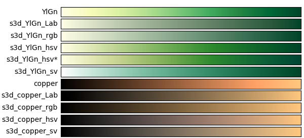
> 
> The script for defining the colormap array is:
> 
```python
YlGn = cm.get_cmap('YlGn')

Lab_cmap_gradient(YlGn(0),YlGn(1.0),name='s3d_YlGn_Lab')
cmu.rgb_cmap_gradient(YlGn(0),YlGn(1.0), name='s3d_YlGn_rgb')
ygnA = cm.colors.rgb_to_hsv(YlGn(0)[:3])
ygnB = cm.colors.rgb_to_hsv(YlGn(1.0)[:3])
ygnC = [ygnB[0],0,1]
cmu.hsv_cmap_gradient(ygnA,ygnB, name='s3d_YlGn_hsv')
cmu.hsv_cmap_gradient(ygnA,ygnB, name='s3d_YlGn_hsv*',smooth=1.6)
cmu.hsv_cmap_gradient(ygnC,ygnB, name='s3d_YlGn_sv')

copper = cm.get_cmap('copper')

Lab_cmap_gradient(copper(0),copper(1.0),name='s3d_copper_Lab')
cmu.rgb_cmap_gradient(copper(0),copper(1.0), name='s3d_copper_rgb')
copA = cm.colors.rgb_to_hsv(copper(0)[:3])
copB = cm.colors.rgb_to_hsv(copper(1.0)[:3])
copC = [copB[0],0,0]
cmu.hsv_cmap_gradient(copA,copB, name='s3d_copper_hsv')
cmu.hsv_cmap_gradient(copC,copB, name='s3d_copper_sv')

cmaps = [ YlGn, 's3d_YlGn_Lab', 's3d_YlGn_rgb', 's3d_YlGn_hsv', 's3d_YlGn_hsv*', 's3d_YlGn_sv',
        copper, 's3d_copper_Lab', 's3d_copper_rgb', 's3d_copper_hsv', 's3d_copper_sv' ]
```
> Grey scale maps:
> 
> 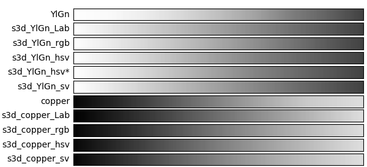
> 
> The Lightness, L*, for the maps is:
> 
> 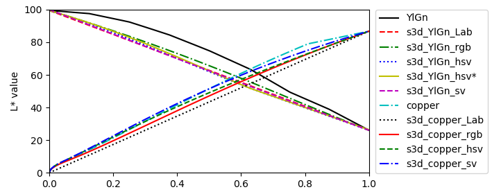
> 
> This is an examination of two custom sequential colormaps in comparison to those provided
> in the Matplotlib package.
> 
> ### Observations
> 
> - The RGB and Lab linear gradients visually mute the saturation and hue. These gradients may not
>   provide an improved visual appearance for replacing the Matplotlib colormaps.
> - For the *YlGn* colormap, the smoothed HSV linear gradient provides a more
>   uniform change in Lightness values compared to the Matplotlib map.
> - For the *copper* colormap, the RGB linear gradient may be appropriate if a nearly
>   linear change in Lightness is required.  However, as mentioned in the first item,
>   the map is more visually muted.
> 
  ---
  ---

> ## Sequential colormaps, II
> 
> 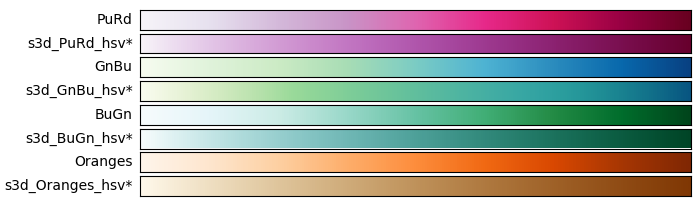
> 
> The script for defining the colormap array is:

```python
cmaps = [ 'PuRd', 'GnBu', 'BuGn', 'Oranges']

def gen_cmaps(old_list) :
    new_list = []
    for cp in old_list :
        cmap = cp
        if isinstance(cmap,str) : cmap = cm.get_cmap(cmap)
        name = cmap.name
        A = cm.colors.rgb_to_hsv(cmap(0)[:3])
        B = cm.colors.rgb_to_hsv(cmap(1.0)[:3])
        C = [B[0],0,1]
        hsvname = 's3d_'+name+'_hsv*'
        cmu.hsv_cmap_gradient(A,B, name=hsvname, smooth=1.6)
        new_list.append(name)
        new_list.append(hsvname)
    return new_list    

cmaps = gen_cmaps(cmaps)
```
> Grey scale maps:
> 
> 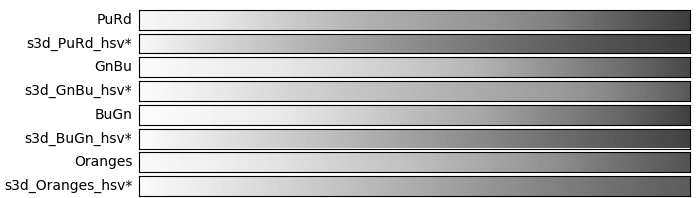
> 
> The Lightness, L*, for the maps is:
> 
> 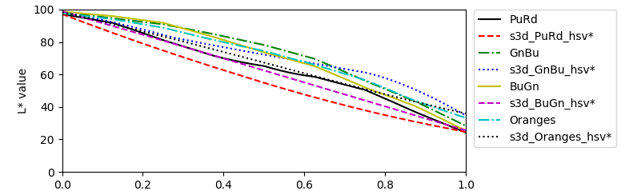
> 
> This is a further examination of custom sequential colormaps in comparison to those provided
> in the Matplotlib package.
> 
> ### Observations
> - The Matplotlib colormaps appear to show more saturated hues with minor sacrificing
>   smoothness in Lstar across the length of the map.
> - Selecting between S3D custom madecolormaps and Matplotlib colormaps is a subjective
>   choice.  Selections may depend on the specific surface onto which the map is applied.

---
---