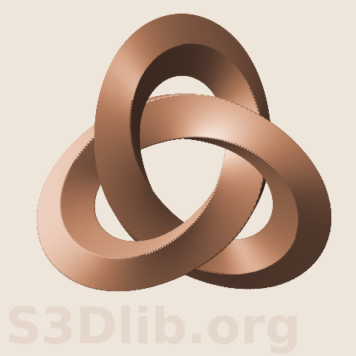

## Tranformation function studies

This directory contains Python scripts and companion
figures using the [S3Dlib](https://s3dlib.org) package.

---

> ### escher_an.py  
>
> Inspired by M.C.Escher - [Knots](https://mcescher.com/gallery/mathematical/)  
> The knot function is based on a trefoil knot, described in [Wikipedia](https://en.wikipedia.org/wiki/Trefoil_knot)  
>
> Since the ring cross-section is square, twists can be multiples of 0.25.
> The right-handed and left-handed varients are controlled by the sign for Z in the Trefoil function.
> The clock and counter-clockwise rotation of the twist in the knot is controlled by the sign
> for t0 in the twistFunction function.  
>
> The following default values were set to match the Escher figure.
> - number of twists, 0.75
> - twist offset, 0.25
> - numerical signs used in the trefoil and twist functions.
> - colors and illumination direction.

---
