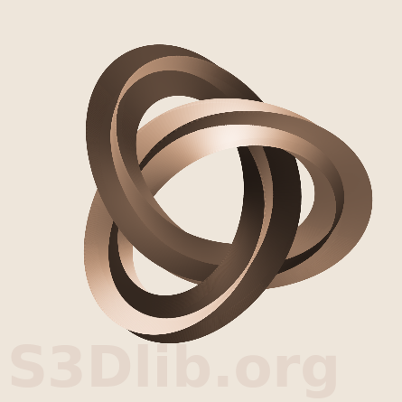

## Tranformation function studies

This directory contains Python scripts and companion
figures using the [S3Dlib](https://s3dlib.org) package.
The studies are used to note limitations and functional improvements to the package.

---

> ### escher_an.py  
>
> Inspired by M.C.Escher - [Knots](https://mcescher.com/gallery/mathematical/)  
> The knot function is based on a trefoil knot, described in [Wikipedia](https://en.wikipedia.org/wiki/Trefoil_knot)  
>
> Since the ring cross-section is square, twists can be multiples of 0.25.
> The right-handed and left-handed varients are controlled by the sign for Z in the Trefoil function.
> The clock and counter-clockwise rotation of the twist in the knot is controlled by the sign
> for t0 in the twistFunction function.  
>
> The following default values were set to match the Escher figure.
> - number of twists, 0.75
> - twist offset, 0.25
> - numerical signs used in the trefoil and twist functions.
> - colors and illumination direction.

---

> ### escher2.py  
>
> Inspired by M.C.Escher - [Knots](https://mcescher.com/gallery/mathematical/)  
> The knot function is based on a trefoil knot, described in [Wikipedia](https://en.wikipedia.org/wiki/Trefoil_knot)  
>
> This example differs from the previous case in that, for this surface, both the outer and inner surfaces are exposed.
> As a result, illumination rendering is not as consistent. Also, twists needed to be multiples of 0.5 for continuous
> surface coloring.  
>
> For this case, a compound surface was constructed. The two initial surface objects were geometrically
> mapped prior to being added together. In the current version, geometric mapping is not permitted for
> compound surfaces. However, it would have been effective to combine the objects prior to mapping
> since both sub-surfaces were of the same type of sub-class object.  
>
> Dev notes for future versions:
> - mirrored shading and highlighting (effectively having two opposing light sources)
> - allow geometric transforms for compound surfaces, iff sub-surfaces are of the same derived class.
>   In such cases, the native coordinates are known and transforms can be made using the sub-class coor transform. 

---

