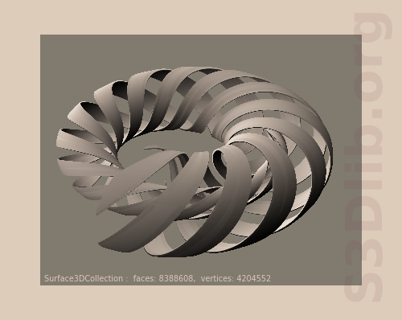
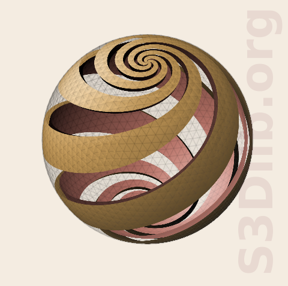
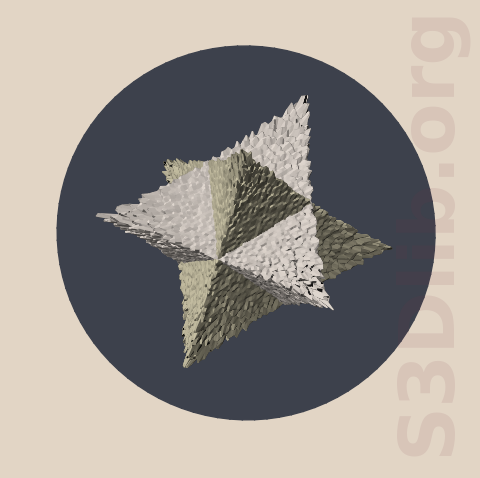
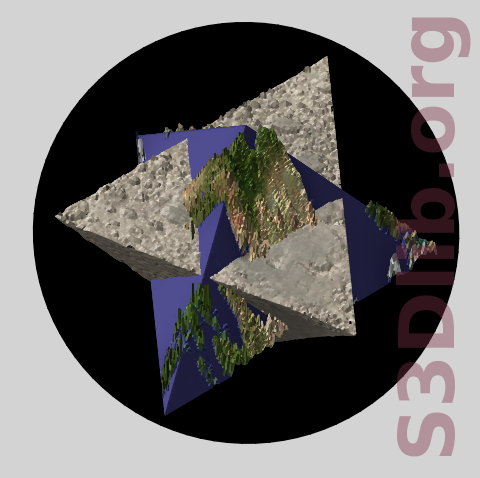
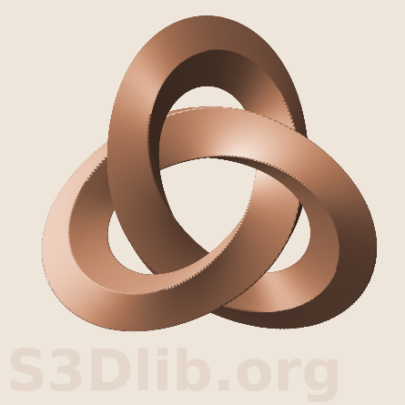
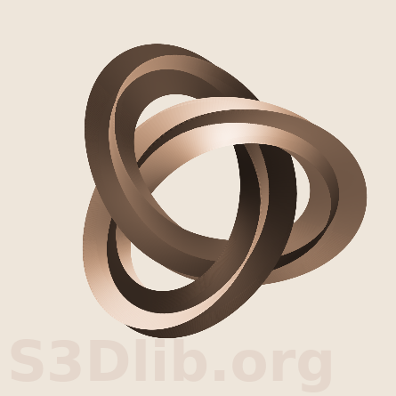
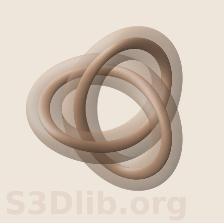
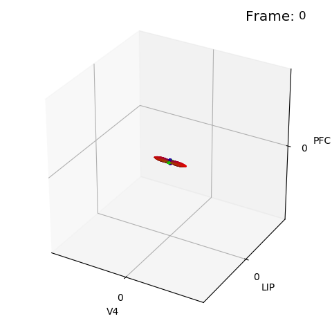
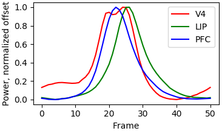

# Tranformation function studies

This directory contains Python scripts and companion
figures using the [S3Dlib](https://s3dlib.org) package.
The studies are used to note limitations and functional improvements to the package.
Complex composite surfaces requiring multiple operations were used to identify any
code errors which might not be realized with simple unit tests.  The Escher 3D
surfaces were useful for this purpose.

---
---

## spirals.py  

Inspired by M.C.Escher - [Spirals](https://mcescher.com/gallery/mathematical/)  

Although a surface object has defined surface normals, Matplotlib 3D renders the surface
color the same regardless of projection of the normal to the view (i.e., there is
no 'front' or 'back' surface).  To provide a realistic view of the twisted ribbons,
the two sides of the surface needed to be illuminated relative to which side
is projected to the illumination source.  To accomplish this, an 'inner' and
'outer' surface composite was used to represent one ribbon surface.  A small
gap between the inner and outer surfaces is needed for proper rendering.
Inner surfaces were illuminated from the opposite direction from the outer surface
illumination direction.

This surface is a composite of eight surfaces, four spirals with two faces.
As a result, the rendering time is significant ( over 8 million faces
for the above surface ).

The sequence of functional steps to create the figure is shown in the
[Spirals Steps](images/spirals_steps.png) multiple subplots figure.

The following default values were set to match the Escher figure.
- number of twists, 5
- angular extention of 1.4
- torus max to min thickness, 0.7 to 0.05
- colors and illumination direction.

Dev notes  
- Future surface object method: *rev_mormals()*.  
  Shadows and highlight were applied to inner and outer surfaces prior to being
  added together as a composite. With the rev_normals() method, the inner surface
  normals could be reversed, then added with the outer surface.  The shadows and
  highlights could then be applied to the composite.  Method would be to simply
  reverse the face indices by switching two columns of the array (cheap one-liner numpy method).
- A future Future surface object method: *dual()*.  
  Create an inner and outer surface as a composite.  More computationally costly
  to translate surface vectors twice, translation amount, when to apply the method, etc.
  Also, would use the *rev_dual* for the second surface ( hence above method needed first ).
- The toroidal reduction was linear with angular position for this surface object,
  however it appears in the Escher figure to decrease more rapidly initially. 
- The method of creating inner and outer surfaces isn't applicable for non-orientable
  surfaces since there is no inner and outer surface, just one surface. (Mobius strip).
  The constructed surface would have a discontinuity in the normals, as
  shown in the *Cyclic and Mirrored Colormaps* documentation example

---
---

## sphericalspirals.py  

Inspired by M.C.Escher - [Sphere Spirals](https://mcescher.com/gallery/mathematical/)  

Like the previous example, inner and outer surfaces were used for each spiral.
However, for this case, these two surfaces differed in color.  An octahedral 
basetype spherical object was used so that the edges of the spirals were 'smooth'.
Cropping this initial base surface, exposing two quadrants provided the starting point
for mapping.
The sequence of functional steps to create the figure is shown in the
[Sphere Spirals Steps](images/sphere_spirals_steps.png) multiple subplots figure.
In the Escher print, the rate of twist is not linear going from pole to pole.
To reproduce a similar twist, an expression for twisting was developed so that
the rate was maximum at the poles and minimum at the equator.

Dev notes  
- Surfaces with transparent faces, with opaque edges are still an issue when 
  used in composite objects.  Edge arrays need to be combined in the add method. 
- When using *set_surface_alpha()*, need to distiguish if affect is either
  faces, edges, or both.

---
---

## planetoid.py  tetraplanetoid.py

Inspired by M.C.Escher - [Double Planetoid](https://mcescher.com/gallery/mathematical/)  

These surfaces are fairly simply constructed.

For the figure on the left, use a pair of Tetrahedron surfaces, as shown in the
'Intermediate Surfaces' documention example. Flip one over and rotate it 180 degrees.
Add the two together. Randomly generated surface textures were created similar to the
'Surface Texture' documentation example,
with the addition of increasing the deviation with increasing distance from the center.
The blue circular background is simply a polar surface, rotated back from the view.

For the right figure, a single Tetrahedron surface is used.  The circular shapes on the
triangular faces are constructed by setting the radius from the origin to a constant.
The sphere color is a map with a gradient in the alpha channel.

Dev Note:  

- Setting the face color in the constructer didn't appear to work for the tetrahedron.
  As a result, the color was set after the object was constructed.  Need to look into this. 
- As noted in the previous example, edge arrays need to be controlled for appropriate
  rendering of composite surfaces with transparencies.  

---
---

## em_planetoid.py

Inspired by M.C.Escher - [Double Planetoid](https://mcescher.com/gallery/mathematical/)  

From the previos example, this is just a very trivial modification to the
*planetoid.py* script.  Surface color and geometry were just image mapped to the surface,
as described in the S3Dlib documentation examples.

---
---

  

## an_escher1.py  
  
Inspired by M.C.Escher - [Knots](https://mcescher.com/gallery/mathematical/)  
The knot function is based on a trefoil knot, described in [Wikipedia](https://en.wikipedia.org/wiki/Trefoil_knot)  
  
Since the ring cross-section is square, twists can be multiples of 0.25.
The right-handed and left-handed varients are controlled by the sign for Z in the Trefoil function.
The clock and counter-clockwise rotation of the twist in the knot is controlled by the sign
for t0 in the twistFunction function.  
  
The following default values were set to match the Escher figure.
- number of twists, 0.75
- twist offset, 0.25
- numerical signs used in the trefoil and twist functions.
- colors and illumination direction.

---  
---  

  

## escher2.py  
  
Inspired by M.C.Escher - [Knots](https://mcescher.com/gallery/mathematical/)  
The knot function is based on a trefoil knot, described in [Wikipedia](https://en.wikipedia.org/wiki/Trefoil_knot)  
  
This example differs from the previous case in that, for this surface, both the outer and inner surfaces are exposed.
As a result, illumination rendering is not as consistent. Also, twists needed to be multiples of 0.5 for continuous
surface coloring.  
  
For this case, a compound surface was constructed. The two initial surface objects were geometrically
mapped prior to being added together. In the current version, geometric mapping is not permitted for
compound surfaces. However, it would have been effective to combine the objects prior to mapping
since both sub-surfaces were of the same type of sub-class object.   
  
Dev notes for future versions:
- mirrored shading and highlighting (effectively having two opposing light sources)
- allow geometric transforms for compound surfaces, iff sub-surfaces are of the same derived class.
  In such cases, the native coordinates are known and transforms can be made using the sub-class coor transform.  

---  
---  

  

## escher3.py  
  
Inspired by M.C.Escher - [Knots](https://mcescher.com/gallery/mathematical/)  
Third in the set using a torus geometry.  
  
As in the previous case, a compound surface was constructed. Again, the same restriction on
compound surfaces requiring the work around. Also for surface with alpha set, the edges are shown
if the linewidth is not set to zero, hence the need for this assignment.  
  
Dev notes for future versions:
- evaluate the issue of requiring linewidth to be set to zero for faces with non-unity alphas. 

---  
---  

## an_escher4.py  
  
Exploration of creating visualization of movement without changes in orientation or geometry.  
  
The s3dlib.cmap_utilites were used to create custom stiched color maps with gradients in the alpha
channels. Using the geometries in the previous case, the maps were simply applied
to varying angular positions of the geometry.   
  
Demonstration of using a:  
- color map with changes in alpha.
- compound color map with regions having alpha set to zero.
- color map applied to various coordinates of the surface geometry.  
  
Dev notes for future versions:
- display a Matplotlib colorbar which is semi-transparent or transparent.

---  
---  

  

## an_power.py  
  
Exploration of an alternative visualization for three line plots over a periodic interval.
The following 2D plots of the data used in the above plot are shown below.  
  
  
  
This data was obtained by modifying the
[powerdata](https://picower.mit.edu/news/information-flows-through-brains-heirarchy-higher-regions-use-higher-frequency-waves) 
to create a period over the frames range with a value range of 0 to 1.  
  
Notes:
- Only problem during code development was noting that the frame argument
  passed into the update_fig() function was of type float.  This argument value
  is an index array and needed to be passed as an int to the data3D() method.  
- This 3D method of visualization does not provide any new conceptional information 
  for this particular data set.  However, this visulization method may be useful for other
  types of data sets, particularly when the frames represent a cyclic time sequence.
- The alternative 3D object can be obtained by xyz scaling ( ellipsoid ) or modidying the
  expression for F in the data3D method ( power of F results in sharpening or smoothing ).
- The simplest coloring of the surface was obtained by directly using RGB space.
- More complex coloring could define a function to pass as an argument to map_geom_from_op().  

---

